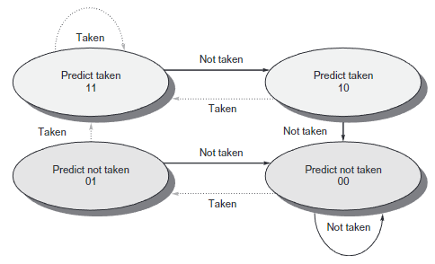
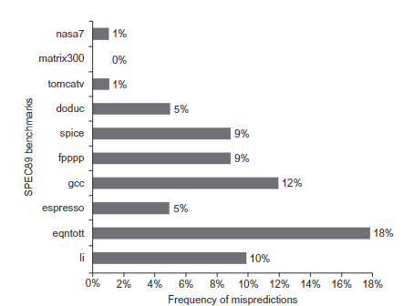
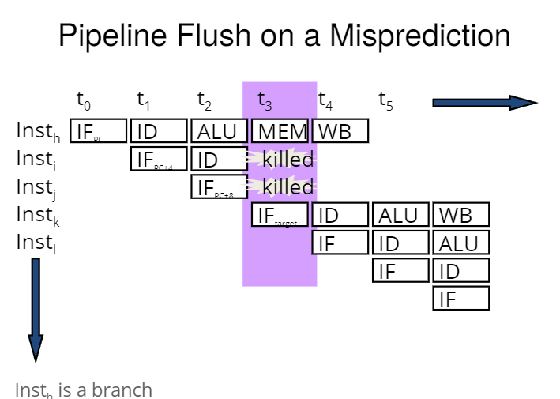
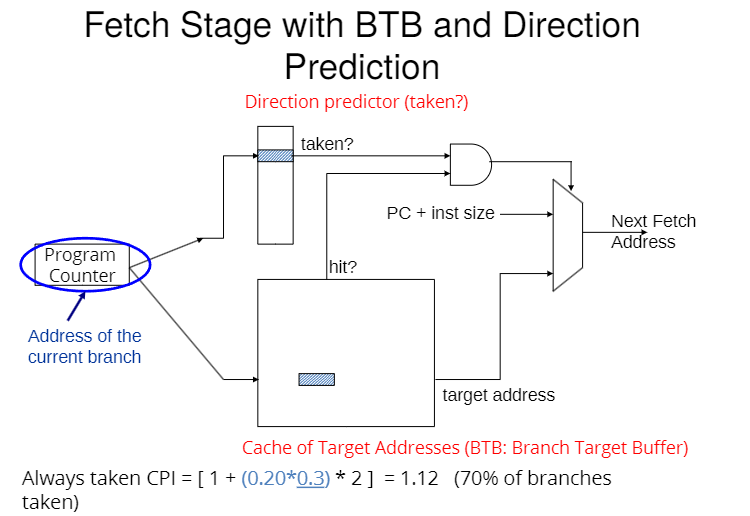
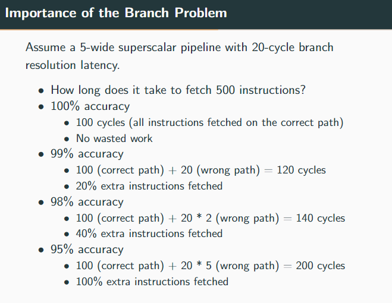
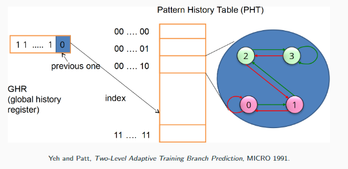
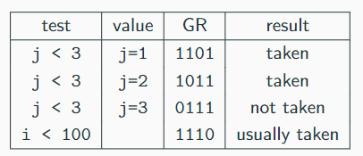
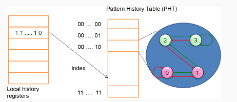

<!-- pandoc example.md -o example.pdf -->

## Handles Branches Book Reading

Because of the need to enforce control dependences through branch hazards and stalls, branches hurt pipeline performance. As pipelines get deeper and the potential penalty of branches increases, using delayed branches and similar schemes becomes insufficient. Instead, we can to turn to more aggressive means for predicting branches.

These schemes fall into two categories: low-cost static schemes that rely on information available at compile time, and strategies that can predict branches dynamically based on program behavior.

### Static Branch Prediction

A way to improve compile-time branch prediction is to use profile information collected from earlier runs. The key observation that makes this run worthwhile is that the behavior of branches is often bimodally distributed. *What this means is that an individual branch is often highly biased toward taken or untaken.*

The effectiveness of any branch prediction scheme depends both on the accuracy of the scheme and the frequency of the conditional branches. Misprediction rates for programs vary greatly depending on the branch frequency *which is the greatest limitation for static branch prediction schemes.*

Dynamic branch predictors are more effectively and most recent processors employ them.

### Dynamic Branch Prediction and Branch-Prediction Buffers

The simplest dynamic branch-prediction scheme is a *branch-prediction buffer* or *branch history table*. A BPB is a small memory indexed by the lower portion of the address of the branch instruction. **I.e., the BPB is essentially another cache.** The BPB says whether the branch was recently taken or not. This scheme is the simplest sort of buffer; it has no tags and is useful only to reduce the branch delay when it's longer than the time to compute the possible target PCs.

Note however, with such a buffer, we don't know for a fact if the prediction is correct. It may have been put there by another branch that has the same low-order address bits. *As we will learn, this doesn't really matter.* The prediction is a hint that's assumed to be correct, and feteching begins in the predicted direction. If the hint is wrong, the prediction bit is inverted and stored back.

As we've stated, the BPB is effectively a cache where every access is a hit, and the performance of the buffer depends on both how often the prediction is for the branch of interest and how accurate the prediction is when it matches. Before we analyze the performance, we must make a small important improvement in the accuracy of the BP scheme.

The 1-bit prediction scheme has a problem: even if the branch is almost always taken, we will likely predict incorrectly twice, rather than once, when it's not taken, since the misprediction causes the prediction bit to be flipped.

**If a branch is almost always taken but occasionally not taken, the 1-bit predictor will flip its state when it encounters the not-taken instance. This causes the next occurrence of the branch (which is likely to be taken) to be predicted incorrectly as well, leading to two mispredictions instead of one.**

To remedy this, 2-bit prediction schemes are often used. In a 2-bit scheme, a prediction must miss twice before it's changed.



A BPB can be implemented a small, special "cache" accessed with the instruction address during the instruction fetch (IF) pipe stage, or as a pair of bits attached to each block in the instruction cache and fetched with the instruction.

If the instruction is decoded as a branch and if the branch is predicted as taken, fetching begins from the target as soon as the PC is known. Otherwise, sequential fetching and executing continues as normal.

A question that arises is *what kind of accuracy can be expected from a BPB using 2-bits per entry on real applications?*



The figure above shows a *misprediction rate* of $1%$ to $18%$. Larger buffers could produce somewhat better results.



As we can see in the figure above, the next two instructions were flushed because the branch prediction was wrong, so the right instructions were fetched and executed.

**More generally, if the branch prediction was incorrect, ALL instructions fetched since the branch prediction must be flushed before the right instructions is loaded.**

### Performance Analysis

From the example above, we can takeaway a couple key ideas:

- Correct Guess = No penalty
- Incorrect Guess = Penalty of 2 cycles or two bubbles

Assuming that we have no data-dependent related stalls (data-hazards), $20%$ control flow instructions, and $70%$ of control flow instructions are taken, we can calculate the CPI as follows:

$$\text{CPI} = 1 + {0.2 \times 0.7} \ times 2$$

Where the $1$ is the normal instruction fetch and the $0.2 \times 0.7$ is the probability of a branch prediction being wrong times the probability of a taken branch times the penalty of a misprediction.

## Lecture 9: Branch Prediction



The slide illustrates the Fetch Stage in a CPU where both the Branch Target Buffer (BTB) and direction prediction are utilized to enhance the efficiency of fetching instructions. Here's a breakdown of the components and process shown in the diagram:

- **Program Counter (PC)**: This holds the address of the current branch instruction that is being processed.

- **Direction Predictor**: This component predicts whether the branch will be taken or not. If the prediction is 'taken', the process moves to check the BTB.

- **Branch Target Buffer (BTB)**: This is a cache that stores the target addresses of previously executed branch instructions. If the BTB has an entry for the current branch (a 'hit'), it provides the target address directly, speeding up the process.

- **Calculation of Next Fetch Address**: If the branch is predicted as taken and the BTB hit occurs, the target address from the BTB is used as the next fetch address. If not, the fetch address is calculated as the current PC plus the instruction size (PC + inst size).

- **CPI Calculation**: The slide also shows a formula for calculating the Cycles Per Instruction (CPI) when branches are always taken. The formula given is $CPI = [1 + (0.20*0.3) * 2] = 1.12$, assuming 70% of branches are taken. This formula accounts for the additional cycles needed when the prediction is incorrect.

**Note, the direction predictor and the BTB serve different purposes. The differences are as follows:**

- DP: This component predicts whether a branch is taken or not. It uses historical data about the branch's past behavior to make this prediction. This is the 1-bit or 2-bit prediction scheme discussed earlier.
- BTB: This component stores the target address of a branch instruction if it's been taken before. When a branch is predicted as taken, the BTB provides the target address directly, avoiding the need to calculate it manually. This speeds up the process of fetching instructions.
  \
  If there's a miss in the Branch Target Buffer (BTB) during the fetch stage, it means that the target address for the current branch is not stored in the BTB. In this case, the CPU must calculate the next fetch address using the program counter (PC) plus the instruction size, as the target address is not readily available from the BTB. This calculation is typically a simple addition of the instruction length to the PC, which points to the next sequential instruction in memory.
  \
  Regarding the replacement policy like Least Recently Used (LRU), the specific policy used can vary depending on the processor design. LRU is a common policy where the least recently accessed entry is replaced when a new entry needs to be added to a full BTB. However, other policies such as FIFO (First-In, First-Out) or random replacement might also be used, depending on the specific implementation and design goals of the CPU architecture.

### Three Things to be Predicted

Recall there are three things which need to be predicted at the fetch stage:

- Whether the fetch instruction is a branch
- Whether the branch is taken or not (direction prediction)
- The target address of the branch (if it's taken)

We accomplish (1) using a BTB because if the BTB has an entry for the program counter, it must be a branch. Alternatively, we could also store branch metadata bits in the instruction cache within the instruction address itself as discussed before.

We've accomplished (3) using a branch target buffer since we can remember the target address computed the last time the branch was taken.

But how can we accomplish (2)? We can use a direction predictor which is a 1-bit or 2-bit predictor. The direction predictor is a small table that stores the direction of the branch (taken or not taken) based on the branch's history. This table is indexed by the lower bits of the branch instruction's address.

### Quantifying the Branch Problem

We can achieve $85% - 90%$ accuracy for many programs wit hthe two-bit counter based prediction. But is this good enough?

Control flow instructions are frequent. The problem is that the next fetch address after a control-flow instruction is determined after $N$ cycles in a pipelined processor.

- N Cycles: (minimum) branch resolution latency
- Stalling on a branch wastes instruction processing bandwidth.
- N $\times$ W instruction slots are wasted.

I.e., when a branch instruction is encountered, the next instruction to be fetched is determined after a delay of $N$ cycles, known as the branch resolution latency. This latency arises due to the need to evaluate the branch and compute the target address.

Stalling the pipeline during branch resolution wastes valuable instruction processing bandwidth.

The product (where W represents the pipeline width) represents the number of instruction slots wasted due to stalling. Stalling occurs since the pipeline must wait until the branch direction is resolved before it can proceed with fetching and executing subsequent instructions.

To mitigate these issues, BP techniques can be used to predict the outcome of a branch instruction before its fully evaluated. This can help fill up the pipeline after the branch to avoid pipeline bubbles.

**The main problem now is to determine the next fetch address when the branch is fetched.**



### Global and Local Branch Prediction

A branche's outcome can be correlated with other branches in the program. This is the basis behind the global branch correlation.

A branch's outcome can be correlated with past outcomes of the same branch. This is the basis behind local branch correlation.

**These came from observing patterns in program behavior and remains a blackbox.**

### Global Branch Correlation

Recently executed branch outcomes in the execution path are correlated to the outcome of the next branch.

For example:

```C++
if (cond1) {...}
if (cond1 && cond2) {...}
```

If the first branch is taken, then the second branch is likely to be taken as well. This is an example of global branch correlation.

Example 2:

```C++
if (cond1) { a = 2; }
if (a == 0) {...}
```

If the first branch is taken, then the second branch is likely not taken.

Example 3:

```C++
if (cond1) {...}
if (cond2) {...}
if (cond1 && cond2) {...}
```

If the first two branches are taken, then the third branch is likely to be taken as well. Vice versa.

So then how does this relate to the global branch correlation? The idea is to associate branch outcomes with a global T/NT history for all branches.

I.e., make a prediction based on the outcome of the branch the last time the same global branch history was executed.

This is implemented as follows:

- Keep track of a global T/NT history of all branches in a global history register (GHR). It's assumed that the GHR is updated after each branch is executed.

- Use the GHR to index into a pattern history table that recorded the outcome that was seen for each GHR value in the recent past.

### Two-level Global Branch Prediction

- Global branch history register (N bits) - stores the direction of the last $N$ branches executed.
- The table of saturating counters for each history entry - stores the direction the branch took the last time the same history was seen.



From the figure, the GHR stores N bits, or N branches. The PHT then uses the GHR as an index to predict whether a branch is taken or not.

### How does the Global Predictor Work?

Consider the following code:

```C++
for (int i = 0; i < 100; i++) {
    for (int j = 0; j < 3; j++) {
        ...
    }
}
```

After the initial startup time, the conditional branches have the following behavior (assuming the global register is shifted to the left):



The global predictor accuracy could then be further improved by adding more context information for the GP to take into account which branch is being predicted.

- GShare Predictor: Combines the global history register with the branch address to create a new index into the pattern history table. This allows the predictor to take into account the branch's address in addition to the global history.
- Pros: More context information and better utilizes the PHT.
- Cons: Increases access latency.

### Local Branch Prediction

**A branch's outcome can becorrelated with past outcomes of the same branch.** Consider the following code:

```C++
for (int i = 1; i <=4; i++) {...}
```

If the loop test is done at the end of the body, the corresponding branch will have the following behavior: TTTTN.

Say we run this loop $n$ times. We don't know how the loop behaves the first time the loop is run. However, on subsequent runs, **if we know the direction this branch has gone on the previous three executions, then we could always be able to predict the next branch direction.**

The basis behind this idea is to have a per-branch history register. It's similar to the global history register, but it associates the predicted outcome based on the history of said branch.

Therefore, this makes a prediction based on the branch's history. It requires two levels of history:

- Per-branch history register: A set of *local history registers* ($N$ bits each). What local history register is used depends on the PC of the branch.
- History at that history register value: Table of saturating counters for each history item. We use this to see the direction the branch took the last time the same history was seen.



### <span style="color:red">Additional Considerations</span>

- Hybrid Branch Predictors
- Tournament Predictors
- Biased Branches
  
  Many branches are biased in one direction. These branches *pollute* branch prediction structures. This makes prediction of the other branches more difficult by causing *interference* in branch prediction tables and history registers.

  We can solve this by detecting biased branches, and predict them with a simpler predictor.

- Predication
