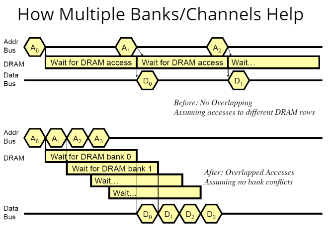

<!-- pandoc example.md -o example.pdf -->

## Lecture 11: Main Memory

### The Main Memory System

The main memory is a critical component of all computing systems: servers, mobile, embedded, desktop, or sensors

Main memory must scale (in size, technology, efficiency, cost and management algorithms) to maintain performance growth and scaling benefits.

As we can see in the picture above, all of the cores share the same caches, L2 and L3, along with disk.

The demand for memory comes from the fact that as applications get increasingly complex, the "working set" or amount of things they need to do at once increases. Meaning there is an inherent need for parallelism, and thus more cores.

Many modern applications and virtual machines today share main memory.

### Major trends affecting Main Memory

Due to the DRAM DIMM capacity and core count increasing in uneven intervals, the memory capacity per core actually drops by $30%$ every two years. Memory capacity is the amount of memory that is available to each core. Memory bandwidth also shows a similar trend. Recall, memory bandwidth is the amount of data that can be read from or stored into memory in a given time period.

Main memory energy/power is also a key system design concern. The energy/power consumption of main memory is a significant fraction of the total system energy/power consumption.

DRAM technology scaling is ending as well, since ITRS projects DRAM will not scale easily below $x$ nm. This is due to the fact that DRAM cells are already very small, and it is difficult to make them smaller. Scaling has provided many benefits like higher capacity, higher density, lower cost, and lower energy.

### DRAM Scaling Problem

DRAM stores charge in a capacitor; if it has a charge, it is a $1$, if it does not, it is a $0$. The problem with DRAM is although other components like the CPU can be scaled down to put more stuff onto it, the DRAM capacitors must be a large enough size for reliable sensing. This is because the charge in the capacitor can leak out, and if the capacitor is too small, the charge will leak out too quickly.

There's proof on the lectures the repeatedly opening and closing a row enough itmes within a refresh interval induces *disturbance errors* in adjacent rows even in modern DRAMs. This is because frequent acessing causes a small electrical charge to leak from he capacitors in the accessed row to adjacent rows. If this happens enough in a short amount of time, in induces the errors as mentioned.

In the figure above, it shows the interactions between the CPUs and a DRAM module. The `mov` instructions load data from memory addreses `X` and `Y` into CPU registers. the `clflush` instructions then invalidate the cache line containing these addresses, forcing the data to be written back to the DRAM.

The `mfence` then ensures that all memory operations before it are complete before any that follow. This sequence when executed in a tight loop, can access the same or nearby DRAM rows at a high rate and lead to disturbance errors.

### DRAM Subsystem: A Bottom-Up View

Some refreshing terminology before we get started:

- Physical address space: Maximum size of main memor, otherwise known as the total number of uniquely identifiable memory locations.
- Physical Addressability: The minimum size of data in memory that is addressable. For example, byte-addressable (8 bits), word-addressable (32 bits), and double-word addressable (64 bits).
- Microarchitectural addressability depends on the abstraction level of the implemention. I.e., whether a system is byte-addressable or word-addressable is determined at this level and affects how memory is organized and accessed.

DRAMs are organized into subsystems as follows:

The figure above shows the organization of a memory bank. When an address is read, the address is loaded to the address register. The address is then the split into the MS and LS bits; the bits used in the MS and LS varies depending on architecture. The MS bits of the address is used to select an appropriate row in the 2D storage array.

After a row is selected and the data is read (amplified), the LS bits of the address are used to select the specific column from the data to be read.

The data from the selected columns of the activated row is then sent out as an output.

### Interleaving

One of the past problems with main memory is that a single monolithic memory array takes very long to access and does not enable multiple accesses in parallel. What it means when multiple accesses can't be done in parallel is that if a request is made to the memory, the memory must wait for the request to be completed before it can process another request.

The goal of early computer scientists was to reduce the latency of memory array access and also figure out a way to enable multiple accesses in parallel.

The idea of interleaving was born. What if we divided the array into multiple banks that can be accessed independently (in the same cycle or consecutive cycles)? Each bank would be smaller than the entire memory storage, and accesses to different banks could be overlapped; while one bank is being accessed another could be preparing for the next access.

But how can you map data to different banks? I.e., how do you interleave data across banks?

Mapping data to different banks (interleaving) involves distributing the memory addresses so that the consecutive addresses map to different banks. This approach helps in reducing access conflicts and latency, and it enhances parallelism. Adjacent addresses are mapped to different banks because if the program had a for-loop or something that read adjacent memory addresses, one bank could have address 1, another could have address 2, etc. This helps prevent one bank from continously flushing the row buffer and increases the number of accesses that can be done in parallel. **The main purpose is to prevent any single bank from being continously accessed which requires frequent activation and precharging.**

There are several basic methods we could use to interleave data:

- Address Bits: Use specific bits of the memory address to determine the bank. For example, if there are four banks, you might use the two least significant bits of the address to select the bank. This means:
    Addresses ending in 00 go to Bank 0
    Addresses ending in 01 go to Bank 1
    Addresses ending in 10 go to Bank 2
    Addresses ending in 11 go to Bank 3

- Modulo Operation: Another common method is to use a modulo operation on the address. For instance, the address could be divided by the number of banks, and the remainder could determine the bank number.

- Interleaving Granularity: The granularity of interleaving (e.g., byte-level, word-level) can also affect how data is mapped. Finer granularity allows more uniform distribution of data across banks, potentially reducing access conflicts further.

### Page Mode DRAM

A DRAM bank is a 2D array of cells: rows and columns. A DRAM row is also known as a *DRAM page*, while the activated row is put in a **row buffer.**

Each address is a <row, col> pair. Access to a "closed row" is as follows:

- *Activate* command opens row and places the row into the row buffer.
- *R/W* command reads/write a specific column within the row buffer.
- *Precharge* command closes the row and places the the row within the row buffer by closing it and prepares itself for the next access by flushing the row buffer.

Accessing to an "open row" doesn't need an activate command. For example, if the access address sequence is something like (Row 0, Col 0) into (Row 0, Col 1), the first command pulls the row into the row buffer, and the second command just reads the data since the row is already open and hit in the buffer. If a different access address with a different row is made like (Row 1, Col 0), the row buffer must be precharged and the new row must be activated. This means that the row buffer is flushed, closed, and the new row is opened and placed in the row buffer.

### The DRAM Chip

DRAM chips consist of multiple *banks*, about 2-16 banks per chip. Banks share commands, address, and data busses. The chip itself has a narrow interface, with 4-16 bits per read; this interface specifically refers to how many bits can be transferred in a single read/write operation.

A DRAM **rank** consists of multiple **chips** operating together to form a wider interface. All chips comprising a rank are controlled simultaneously. This means that they all respond to the same command, and they all share address and command buses, but provide different data. E.g., when a for loop accesses an array, the command to access the array is effectively split into multiple individual memory accesses; each access is sent to a different chip in the rank.

In the context of DRAM systems, the sharing of address buses among different banks doesn't imply that all banks are accessed at the same time or that they all receive the same idea. Instead, it means theat the same address bus is used to route address information to differnt banks, but at different times or under different control signals. The bus sends the address information to all banks, but each bank is equipped with its own set of control signals. These determine whether a particular bank should respond to the current address being placed on the bus.

The memory controller also includes logic to select which banks should be active for a given memory location; this selection is based on the address itself, which is decoded to target a specific bank. Even though the address bus is shared, the banks operate independently. This means while one bank is being accessed, others are not necessarily active unless they are being accessed as well.

A DRAM **modules** consist of one or more ranks. For example DIMM (Dual Inline Memory Module) is a module that contains multiple ranks. This is what we actually plug into the motherboard. If we have chips with 8-bit interfaces, to read 8 bytes in a single access, we would want 8 chips in a DIMM.

Above modules are **channels**, where multiple modules are connected to a single channel. The advantage of using channels is that it enables even higher capacity, or higher bandwidth. However, the interconnecting complexity and energy consumption also increases and the cost of the system increases as well.

### DRAM Subsystem

From the figure above, the processor has memory channels that connect to the memory controller. The memory controller then connects to the DRAM modules. The DRAM modules contain ranks, which contain chips, which contain banks. The banks contain rows and columns.

We commonly use something called the DIMM (Dual Inline Memory Module) which is a module that contains 2 ranks, one on each side.

### DRAM Subsystem Operation

