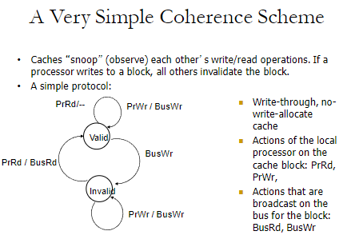

<!-- pandoc example.md -o example.pdf -->

## Recap: Memory Consistency Difficulties

- Depending on the task, there will be little difficulty if parallelism is natural. However, the main problem with parallel programing is (1) getting parallel programs to work correctly, and (2) optimizing performance in the presence of bottlenecks.

Much of parallel computer architecture is all about **(1) designing machines that overcome the sequential and parallel bottlenecks to achieve higher performance and efficiency, and (2) make the programmer's job easiser in writing correct and high-performance parallel programs.**

## Performance vs. Correctness

These two metrics are always fundamentally at odds with each other. The more you optimize for one, the more you sacrifice the other. This is known as the **Performance-Correctness Tradeoff.** For example, improving performance at the expense of correctness can be done by forgetinning critical locks in our program or designing the architecture to ignore ordering of oeprations.

There are examples of this in multiprocessor operations (MIMD) in regards to memory ordering (consistency) and cache coherence.

## Memory Consistency vs. Cache Coherence

- **Consistency** is all about ordering of **all memory operations** from different processors (i.e., to different memory locations).
  I.e., it refers to the rule that defines the expected order of visible effects on memory operations (like reads and writes) across different processors. It ensures that all processors agree on the order in which memory locations would occur, even if they are not physically ordered in memory.
  I.e., this is like having a universal rule  book that all processors follow to decide whose turn it is to access memory.
- **Coherence** is all about ordering of **operations** from different processors **to the same memory location.**
  This concept deals with maintaining a consistent state of the data across various cache copies in different processors. When multiple processors have copies of data from the same memory location, cache coherence ensures that all copies are kept up-to-date with the latest value of the data. So any changes made by one processor are visible to all other processors. It's like making sure everyone has the same copy of the same book.

## Memory Ordering in a Single Processor

- Specified by the von Neumann model. I.e., the order of memory operations is the same as the order of the instructions in the program.
  It runs sequentially where hardware will execute instructions in the order they are written in the program.

- OoOE does not change the semantics. I.e., hardware retires (reports to software the results of) the load and store operations in the order they were issued by the software.

- Pros: (1) Architectural state is precise within the execution, meaning that the state of the machine is always consistent with the program order. (2) architectural state is consistent across different runs of the program, making it easier to debug.
- Cons: (1) Preserving order adds a lot of overhead, and (2) reduces performance, increases complexity, and reduces scalability.

## Memory Ordering in a MIMD Processor

In a MIMD processor, each processor's memory operations are in sequential order with respect to the *thread* running on that processor. I.e., we can imagine each processor as a worker following a specific set of instructions one by one. Each processor does this independently.

Multiple processors can execute instructions in parallel, but how can the memory see the order of operations from all processors? I.e., what is the ordering of operations across different processors?

**I.e., in a MIMD architecture, each processor operates indepdently, and executes different instructions on different data at the same time. This independence allows for flexibility in how instructions are ordered and executed across multiple processors. However, it incurs overhead to ensure that the mem operations appear ina consistent order to all processors.**

To manage the ordering of instructions and ensure consistency, MIMD architectures often use memory consistency models. These models define the rules by which operations (reads and writes to memory) appear to be executed relative to each other across different processors. Common consistency models include sequential consistency, weak consistency, and release consistency, among others.

Additionally, mechanisms like barriers and locks can be used to synchronize operations between processors, ensuring that all processors see the same memory state at critical points of execution. This synchronization helps in 'bypassing' the free-for-all nature of instruction execution in MIMD systems, making sure that despite the independent operation of each processor, the overall program executes correctly and predictably.

### Protecting Shared Data

To protect shared data, threads are not allowed to update shared data simultaneously for correctness purposes. Accesses to shared data are encapsulated inside **critical sections** or **protected via synchronization constructs (locks, semaphores, condition variables).**

I.e., only one thread is allowed to execute a critical section at any given time; this is known as the **mutual exclusion property.**

Multiprocessors should provide the correct execution of **synchronization primitives** (which are used to protect shared data) to enable the programmer to protect shared data.

Programmers need to make sure mutex (synchronization) is correctly implemented in the hardware. Programmers also rely on hardware primitives to support correct synchronization. If hardware primitives are not correct (or unpredictable), it's very difficult to write correct parallel programs. The same applies if the hardware primitives are correct but not easy to reason about or use.

**In the von Neumann model, processors execute instructions sequentially, as specified by the instruction pointer. However, when two processors are involved, issues related to memory consistency and coherence can arise, especially in a multiprocessor system where each processor has its own view of memory operations. This can lead to situations where both processors enter a critical section simultaneously if they do not see the same order of operations to memory or if the "happened before" relationship between updates is inconsistent. Each processor might think the other is not in the critical section due to these inconsistencies, thus violating the mutual exclusion principle typically required in critical sections. Proper synchronization mechanisms are needed to prevent such scenarios and ensure safe access to critical sections.**

## How can we solve the problem?

Idea: Sequential Consistency

All processors see the same order of operation to memory, i.e., all memory operations happen in an order (called the global total order) that is the same for all processors.

An assumption needs to be made: Within the global order, each processor's operations appear in sequential order with respect to its own operations. I.e., the sequence of operations performed by any single processor will appear in a sequential manner from the perspective of that processor.

I.e., even though multiple processors might be involved, each processor perceives its own actions as happening one after another, without any interruptions or reordering.

Imagine a classroom where the teacher asks questions to the students, and each student writes their answer on a shared blackboard. The rule is that the students must write their answers in the exact order their names are called by the teacher, and all students must observe the answers being written in this order.

In this analogy, the teacher's calling of names establishes a global order (like the global total order in memory operations), and each student writing their answer sequentially according to when they were called corresponds to each processor performing its operations in a sequential order. This ensures that all students (processors) see the answers (memory operations) appearing on the blackboard (memory) in a consistent and predictable sequence, maintaining the integrity of the information shared among them.

### Sequential Consistency

Multiprocessor systems are sequentially consistent if the result of any execution is the same as if the operation of all the processors were executed in some sequential order AND the operation of each individual processor appears in the sequence of the order specified by the program.

I.e., the outcome of running any set of operations on the system should be the same as if these operations were performed one after the other in some specified order, even though they're actually executed in parallel.

The operations performed by each processor must occur in the order that the program specifies for the processor. This means that each processor follows the script of the program without skipping or reordering any steps.

### Programmer's Abstraction

- Memory is a switch that services one load or store at a time from any processor. All processor see the currently serviced load/store at the same time, and each processor's operations are serviced in the order specified by the program.

### Consequences of Sequential Consistency

Recall that within the same execution, all processors see the same global order of operations to memory. From this, that means there is no correctness issue since all processors see the same order of operations. It also satifies the "happened before" intuition" because the global order is the same for all processors.

Across different executions, different global orders may be observed since the order of operations is not specified. This means that the same program may produce different results across different executions. Debugging becomes difficult since the same program may produce different orders of operations across different runs.

There are also several other issues relating to sequential consistency like OoOE and caching.

- OoOE: Loads happen out-of-order with respect to each other and with respect to independent stores, which can make it difficult for all processors to see the same order of operations.
  
    I.e., processors would normally execute instructions in the order they appear. But for efficiency reasons, OoOE allows processors to execute instructions as soon as resources are available rather than strictly following the program order. This can lead to situations where mem operations are completed in a different order than expected, causing inconsistencies in the global order of operations across processors.

- Caching: A memory location is now present in multiple places. This prevents the effect of a stores to be seen by other processors, which can lead to inconsistencies in the order of operations.
  
  Caching stores frequently accessed data in faster storage closer to the processor. While this speeds up access time to data, it means when processors update a value in the cache, other processors may not see the update immediately if they have an older copy in their own caches.

*Is the global order requirement too strong?* Do we actually need a global order across all operations and processors? How about a global order only across stores? How about enforcing a global order only at the boundaries of synchronization operations?

## Weak Memory Consistency

Note, the ordering of operations is important when the order affects operations on shared data; i.e., when the processors need to synchronize to execute a specific program region.

The idea behind weak memory consistency is that programmers should specify regions in which memory operations do not need to be ordered. "Memory fence" instructions delinate these regions. From this:

- All mem ops before a fence must complete before fence is executed.
- All mem ops after the fence must wait until the fence is executed.
- Fence complete in program order.

All synchronization operations are fences.

An analogy for understanding weak consistency in computer systems can be likened to organizing a group project where team members are working in different locations. Imagine each team member is assigned specific tasks (memory operations) and they are allowed to complete these tasks in any order they prefer, as long as they all check in during scheduled meetings (memory fences).

In this scenario, team members work independently on their parts of the project, and there's no need for them to coordinate every detail with each other continuously. However, during the scheduled meetings, everyone updates the group on their progress, ensuring that all parts align before moving forward. These meetings act like synchronization points where the order of updates is reviewed and confirmed, similar to how memory fences ensure that all operations before the fence are completed and visible to all processors before proceeding.

Pros: No need to guarantee a very strict order of mem ops. It also enables the hardware implementation of performance optimizations to be simpler.

Disadvantages: Burdens the programmer or software to get the fences correct.

## Cache Coherence

Recall, many parallel programs communicate through *shared memory.*

Each read should receive the value last written by anyone. This requires synchronization between caches. In addition, what happens if multiple processors cache the same block? How do they ensure that they all have the same value?

**So who's responsibility is it to ensure cache coherence?**

- Software
  
  Can the programmer be responsible for ensuring that all processors have the same value? This is difficult because the programmer may not know the state of the cache at any given time.

- Hardware
  
  It should be the hardware's job. An idea is to **invalidate all other copies of block A when a processor writes to it.**

In the coherence scheme depicted in the image, when Processor A writes to a cache block (let's call it Block A), the caches in other processors that might have a copy of Block A will observe ("snoop") this write operation.

As a result, these other caches will invalidate their copies of Block A. This invalidation means that the data in these other caches is marked as outdated. Additionally, this doesn't mean that the other processors have to redo their instructions; the other caches do not automatically update their values at the moment of invalidation. Instead, if they need to access Block A after it has been invalidated, they will fetch the latest value either from the main memory or through a new read operation on the bus. This ensures that all processors work with the most current data, maintaining consistency across the system.

Coherence schemes typically target a cache line, not the entire cache. **Recall, caches are divided into small units called cache lines/blocks. Coherence protocols maintain consistency at this level. For example, if a line is updated by one processor, coherence protocols ensure that other caches see the updated value or mark their copy as invalid.**

By focusing on cache lines, schemes can achieve consistency with fine granularity while maintaining efficiency. If conherence were maintained at the entire cache level, it would be less efficient due to the large amount of unnecessary invalidations or updates.

## Maintaining Coherence

**We need a way to guarantee that all p see a consistent value for the same mem location.**

For example, writes to location $A$ by P0 should be seen by P1 (eventually), and all writes to A should be seen in the same order by all processors.

Coherence needs to provide:

- Write propagation: Guarantee that updates will propagate.
- Write serialization: Provides a consistent global order seen by all processors.

We need some sort of global point for serialization in this store ordering.

The basic idea is that a processor/cache will broadcast its write/update to a mem location to all other processors. Another cache that has the location either updates/invalidates its local copy.

## Update vs. Invalidate

How can we *safely* update the replicated data?

- Option 1: Push an update to all copes
- Option 2: Invalidate all other copies so it ensures that there is only one copy (local), and update it.

On a read:

- If local copy is invalid, put out a request to all other caches to get the value.
- If another node has a copy, it returns it, otherwise main memory is accessed.

On a write, we would read the block into cache as before.

### Option 1: Update Protocol

Write to block, and simultaneously broadcast written data and address to sharers. Other nodes then update the data in the block if present.

If the sharer set is constant and updates are infrequent, it helps avoid the cost of invalidate-reacquire (broadcast update pattern).
However, if the data is rewritten without intervening reads by other processors, the update was useless.
Write-through cache policy means bus also becomes a bottleneck.

### Option 2: Invalidate Protocol

Write to block, and simulatenously broadccast invalidation of address to sharers. Other nodes then invalidate the block if present.
After invalidation broadcast, the core has exclusive access rights. Only cores that keep reading after each write retain a copy. If write contention is high, it leads to ping-ponging where rapid mutual invalidation-reacquire occurs.

## Cache Coherence Methods

How do we ensure that the proper caches are updated?

- **Snoopy Cache Coherence**: All caches could snoop other cache's mem requests and keep the cache block coheerent. Each cache block has coherence metadata associated with it in the tag store of each cache.
  
  This is easy to implement if all caches share a common bus since each cache broadcasts its mem operations on the bus. Good for small-scaled multiprocessors.

- **MSI**: Extend metadata per block to encode three states; modified, shared, and invalid. Modified cache line is the only cached copy and is dirty (not consistent with main memory). Shared cache lines is potentially one of several cached copies (is consistent with main memory). Invalid means the cache line is not present in the cache.

  Read miss makes a *read* request on the bus, and transitions to shared state since it may already exist within other caches. Write miss (or write) to a shared line makes a *ReadEx* request and transitions to **M** state. Whenever a processor snoops *ReadEx* from another writer, it must invalidate its own copy if it has one.

  To go from S->M, it can be done without re-reading data from mem.
  
  

  The main problem with MSI is on a read, the block immediately goes to the "Shared" state although it may be the only copy to be cached (this occurs because no blocks are in any cache to begin with).

  Suppose a cache that reads the block wants to write to it at some point. It needs to broadcast "invalidate" even though it has the only cached copy. *If the cache knew it had the only cached copy in the system,* it could've written to the block without notifying any other cache and saved a lot of unnecessary broadcasts of invalidations. **To solve this, we introduce MESI.**

- **MESI**: Add another state indicating that it's the only cached copy and it's clean, **E** or **exclusive state.**
  
  Block is placed in the *exclusive state*, if during **BusRd**, no other cache has it. Snooping caches assert automatically if they have a copy.
  
  A silent transition from **E->M** is possible on a write.
  
  

  The problem with MESI is that shared state requires the data to be clean, meaning all caches that have the block have the most recent copy and so does the memory. The problem rises when there's a need to write the block to memory when *BusRd* happens when the block is in the modified state.

  Memory can be updated unnecessarily, even though some other processor may want to write to the block again.
  
  To improve this several ideas popped up:

    - Do not transition from M->S on a BusRd. Invalidate the copy and supply the modified block to the requiesting processor directly without updating memory.
    - Transition from M->S but designate one cache as the owner (O), who will write the block back when it's evicted. Now Shared means "Shared and potentially dirty."

### Potential MSI vs MESI Questions

**What are the main differences between MSI and MESI protocols?**

MSI (Modified, Shared, Invalid): This protocol uses three states. A cache line can be in Modified state, indicating it has been changed and is not consistent with memory; Shared state, indicating the line may be stored in multiple caches and is consistent with memory; and Invalid state, where the cache line is not present in the cache.
MESI (Modified, Exclusive, Shared, Invalid): MESI adds an Exclusive state to the MSI protocol. The Exclusive state indicates that the cache line is present only in the current cache and has not been modified, allowing the cache to transition directly to Modified without a bus transaction if a write occurs.
**How do MSI and MESI handle a write miss?**

MSI: On a write miss, the cache line is fetched into the cache, and other copies in the system are invalidated if necessary, transitioning the line to Modified state.
MESI: Similar to MSI, but if the block is in Exclusive state, it can directly transition to Modified without invalidating other copies, as no other copies exist.
Which protocol provides better performance and under what conditions?

MESI generally provides better performance than MSI because it reduces the number of bus transactions required for cache lines in the Exclusive state. This reduction is particularly beneficial in systems where write operations to exclusive blocks are frequent, as these transitions do not require bus invalidation.

