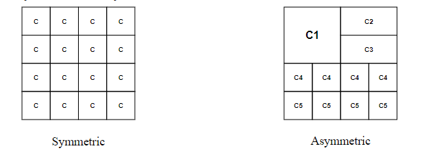

<!-- pandoc example.md -o example.pdf -->

## Parallelism Overview

**Why do we need them?**

- Improves performance through execution time or task throughput. However, recall that the execution time of a program is governed by Amdahl's Law, which states that the speedup of a program is limited by the fraction of the program that cannot be parallelized.

- Reduces power consumption by distributing the workload across multiple cores. 4N units at freq F/4 consumes less power than N units at freq F because because more work is done in less time.

**Types of parallelism that can be exploited:**

- **Instruction Level Parallelism (ILP):** Exploits parallelism within a single instruction stream. This is done through techniques such as pipelining, superscalar execution, and out-of-order execution. *Different instructions with in a stream can be executed in parallel.*
- **Data Parallelism:** Different pieces of data can be opeated on in parallel. This was shown in SIMD and array processing.
- **Task Parallelism:** Different tasks can be executed in parallel. This is the most common form of parallelism in multiprocessors.

We cover task parallelism in this lecture.

## Task Parallelism

We can do this by partitioning a single problem into multiple related tasks (threads). This is necessary when tasks are natural to the problem, like web/database queries; but difficult to implement when the natural task boundaries are unclear.

The idea is to **run many independent tasks or processes togteher.** This is easy when there are many processes like batch simulations, different users, and cloud computing workloads. **Note,** however that it does not improve the performance of a single task.

## Multiprocessing Fundamentals

There are two types of multiprocessors:

- Loosely coupled multiprocessors:
  
  **These don't share a global memory address space.** Instead, it utilizes an architecture similar to a multicomputer network, where the multiprocessors communicate through message passing like explicit send receive calls.

- Tightly coupled multiprocessors:
  
  **These systems share a common memory that's accessible by all processors, making them work more closely together.** Instead, they operate like a single computer with multiple brains that can all access the same memory and need to coordinate (synchronize) when they access the same data to avoid conflicts.
  \
  Several issues arise from tightly-coupled MP. Shared memory synchronization is one, which was detailed above. Cache consistency and coherence is another, this is to ensure all processors see the same data in the cache, even if one processor changes it. Ordering of mem operations is a concern because how can be predict how the system haves when different processors access memory at the smae time?
  \
  Resource sharing is also a problem because processors share and compete for memory and processing power. Partitioning helps divide resources efficiently among processors. Load imbalances are also an issue when processors are doing more work than others.

## Utilization, Redundancy, and Efficiency

- **Utilization:** The fraction of time a processor is busy. This is the most important metric for performance.
  
  $$U = \frac{(# \text{Operations in parallel version})}{\text{processors } \times \text{ Time}}$$

- **Redundancy:** How much extra work is done with parallelism.
  
    $$R = \frac{(# \text{Operations in parallel version})}{(# \text{Operations in serial version})}$$

- **Efficiency:** The ratio of the speedup to the number of processors.
  
    $$E = \frac{\text{Time with 1 processor}}{\text{processors } \times \text{ Time with P processors}}$$

## Caveats with Parallelism

- Amdahl's Law: Recall $f$ is the parallelizable fraction of a program. $N$ is the number of processors. The speedup equation is as follow:

    $$\text{Speedup} = \frac{1}{1-f + \frac{f}{N}}$$

**Maximum speedup is limited by the serial portion, this is known as the serial bottleneck.** Additionally, the parallel portion is never perfectly parallel due to synchronization overhead, load imbalance overhead, and resource contention overhead.

## Assymetric Enables Customization

- Symmetric: One Size fits all
  
  Energy and performance suboptimal for different workload behaviors.

- Asymmetric: Enables customization and adaption
  
  Processing requirements will vary across workloads (applications and phases within the program). It'll execute code on best-fit resources.

Asmmetry is a way of enabling specialization. It helps bridge the gap between purely general purpose and purely special purpose. Purely general is a single design for every workload and metric, purely special is a single design per workload or metric, while asymmetric uses multiple sub-designs optimized for sets of workloads/metrics and glues them together.

Pros:

- Can enable optimization of multiple metrics
- Can enable better adaption to workload behavior
- Can provide special-purpose benefits with general-purpose usability/flexibility

Cons:

- Higher overhead and more complex design
- Higher management overhead due to scheduling for asymmetric components
- Overhead in switching between multiple components can lead to performance degradation

The demands vary in different code sections. In serialized code sections, we want one powerful large core, while in parallel code sections, we want many wimpy small cores.

However, these two conflict with each because if you have one big core, you cannot have many cores. Small cores are also more energy and area efficient than large cores.

## Amdahl's Law Modified

Amdahl's Law is modified for asymmetric systems. Several assumptions are made:

- Serial portion executed on the large core
- Parallel portion executed on the small core AND large cores
- f = fraction of the code that is parallelizable
- L = number of large cores
- S = number of small cores
- X: Speedup of a large processor over a small one

$$\text{Speedup} = \frac{1}{\frac{1-f}{X} + \frac{f}{S + X*L}}$$

