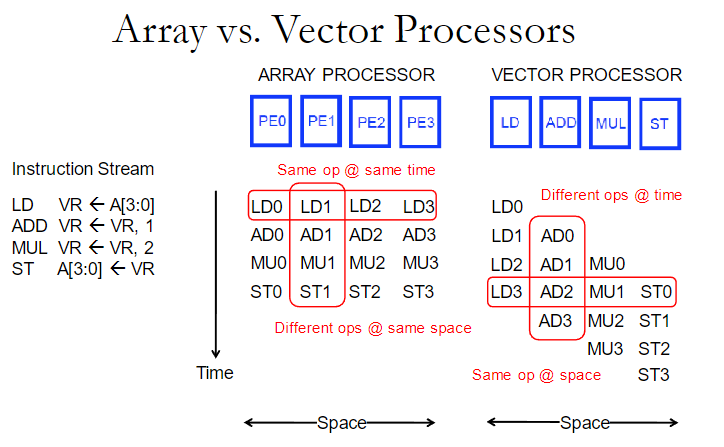
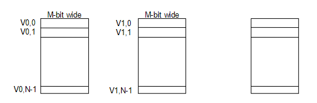
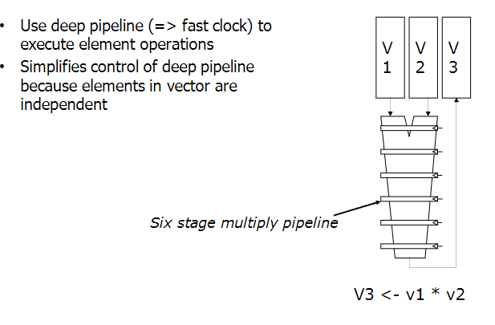
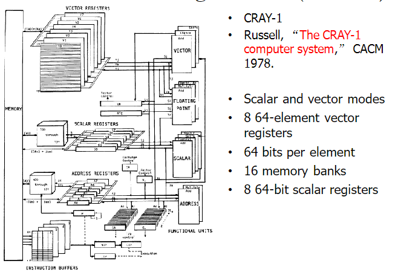
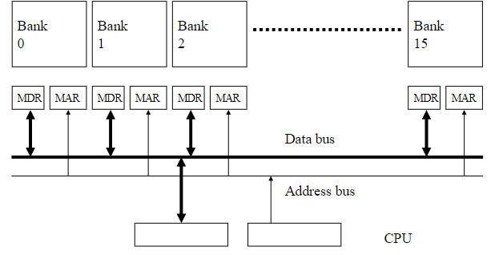
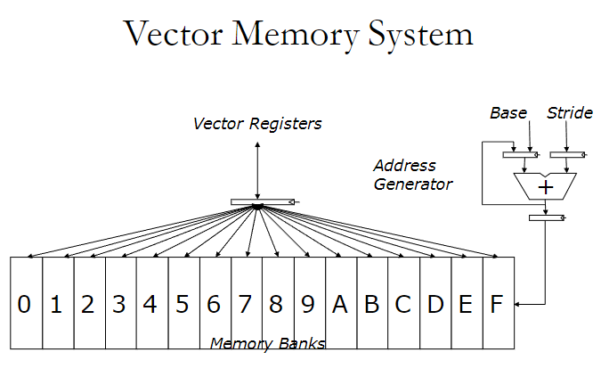
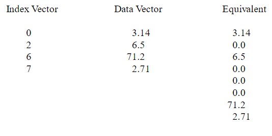
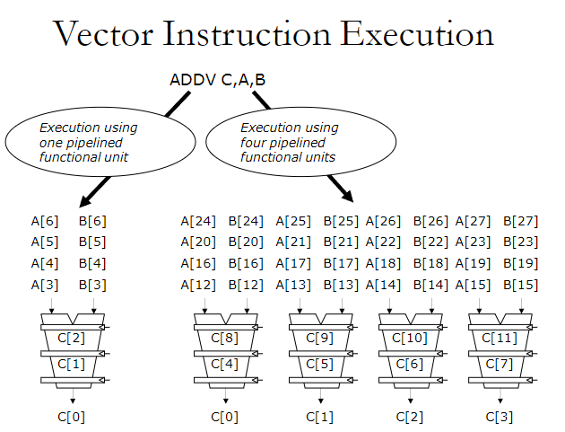
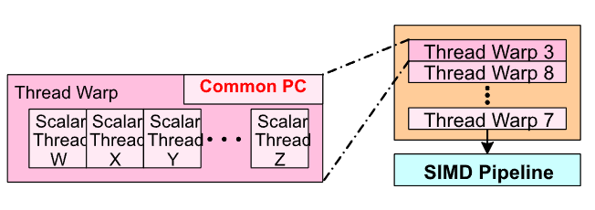

<!-- pandoc example.md -o example.pdf -->

## Lecture 11: Vector Processing and SIMD

There are several classifications of computers:

- SISD: Single Instruction, Single Data. This is when a single instruction operates on a single piece of data.
- SIMD: Single Instruction, Multiple Data. This is when a single instruction operates on multiple pieces of data. This is prevalent on array processors and vector processors.
- MISD: Multiple Instruction, Single Data. This is when multiple instructions operate on a single piece of data.
- MIMD: Multiple Instruction, Multiple Data. This is when multiple instructions operate on multiple pieces of data. This is prevalent in multiprocessors, and multithreaded processors.

### Data Parallelism

Concurrency arises from performing the *same operations on different pieces of data.* E.g., single instruction multiple data (SIMD) and multiple instruction multiple data (MIMD). For example, taking the dot product of two vectors is a data parallel operation because the same operation is performed on each pair of elements in the vectors.

### SIMD Processing

In SIMD, as we recall, a single instruction operates on multiple data elements in time or in space. There are multiple processing elements. The same instruction is executed on all processing elements, but each processing element operates on a different data element.

For the time-space duality:

- Array processors: Instructions operate on multiple data elements at the asme time.
- Vector processors: Instructions operate on multiple data elements in sequence. This is efficient in scenarios where the same operations need to be performed on a series of data elmeents.
  
  Example of Vector Processing: Consider a simple operation where we want to add two arrays of numbers: A = [a1, a2, a3, ..., an] and B = [b1, b2, b3, ..., bn]. In vector processing, a single vector instruction could perform the addition of corresponding elements from each array in consecutive cycles. This would look something like:

    Cycle 1: Compute a1 + b1
    Cycle 2: Compute a2 + b2
    Cycle 3: Compute a3 + b3
    ...
    Cycle n: Compute an + bn
    This method is much faster than scalar processing, where each addition would be handled as a separate instruction, requiring more time to execute the same number of operations.

As seen in the figure above:

- Array Processor
  
  The same operation is carried out at the same time. All processing elements (PE0, etc) perform the same operation simultaneously on different data elements.

  This is shown on the instruction stream when oeprations like LD0, AD0, MU0, and ST0 are performed on different data elements at the same time.

  Additionally, different operations can occur at the same spatial location (processing element), at different times. This is depicted by the vertical sequence of differenct instructions (LD0, AD0, MU0, ST0) in the same column for each processing element.

- Vector Processor
  
  Different operations are then carried out at different times. The sequential processing of different instructions is shown horizontally across the time axis.

  The same operation is also performed across the space of the processor but at different times, as indicated by the horizontal alignment of operations (LD0, AD0, MU0, ST0) across different cycles.

**The key takeaway is that array processors execute the same operation accross all elements at the same time making them suitable for tasks with high data parallelism. VPs handle a sequence of operations on a data set over time, which is more flexible but might not offer the same level of parallelism for single operations as array processors.**

### Vector Processing

Vectors are 1D array of numbers. VPs are processors whose instructions operate on vectors rather than scalar (single data) values.

Basic requirements for a vector processor:

- Need to load/store vectors. These require special registers called **vector registers**.
- We also need to be able to operate on vectors of different lengths. Meaning we also need a **vector length register (VLEN)**.
- Elements of a vector might be stored apart from each other in memory, so we need a **stride register** to keep track of the distance between elements.

Vector instructions perform an operation on each element in consectuive cycles. The vector functional units are pipelined, and each pipeline stage operates on a different data element.

Vector instructions allow deeper pipelines since there are no intra-vector dependencies. This means that the next instruction can be fetched and executed while the current instruction is still being processed. There are also no control flow within a vector, so there are no branches within a vector. Additionally known strides allow prefetching of vectors into the cache.

**Analogy**:

Vector Instruction as an Assembly Line: Imagine an assembly line in a factory where each worker (pipeline stage) is responsible for adding a specific part to a product (data element). The products move down the line, and each worker performs their task on the product as it comes by. In a vector processor, each 'worker' is a stage in the pipeline, and each 'product' is an element of the data vector. The operation (like adding a part) is performed on each data element as it moves through the pipeline stages.

Consecutive Cycles: Each worker completes their task in consecutive cycles, meaning as soon as one worker finishes with a product, the next worker starts their task on it. This is similar to each pipeline stage operating on a different data element in consecutive cycles.

Deeper Pipelines and No Dependencies: Since there are no dependencies between the tasks of different workers on the same product, the assembly line can be long and complex (deeper pipelines), and work can flow smoothly without waiting for previous tasks to complete. This is akin to vector instructions not having intra-vector dependencies and no control flow issues within a vector.

Prefetching: Knowing the sequence of products coming down the line (known stride), the factory can prepare and bring necessary parts closer to the line (prefetching into cache/memory), ensuring that workers have everything they need right when they need it, without delays.

**The key difference between vector processing and a regular sequential (scalar) pipeline is how they handle data and instructions:**

**Vector Processing:**

**Parallel Data Handling: Multiple data elements are processed simultaneously under a single instruction. This is possible because the pipeline stages are designed to handle different elements of a vector concurrently.**
**Efficiency in Data-Intensive Operations: Vector processors are particularly efficient for operations that can be applied uniformly across a large set of data, such as in scientific computing or multimedia applications.**
**Sequential (Scalar) Processing:**

**Single Data Handling: Each instruction processes a single data element. The pipeline stages process one instruction at a time, moving to the next instruction only after the previous one is complete.**
**General Purpose: More suited for general-purpose computing where operations might not uniformly apply to multiple data elements.**

### VP Pros and Cons

Pros:

- No dependencies within a vector, so pipelining and parallelization work well. This also allows us to have a deeper pipeline.
- Each instruction gereates a lot of work, so it reduces the overhead of instruction fetch and decode.
- Highly regular memory access pattern, so it is easy to prefetch data. we can also interleave the data of vectors to multiple banks of memory to increase bandwidth.
- No need to explicitly code loops so it is easier to program and there are less branches in the instruction sequence. Less overhead for branch prediction.

Cons:

- It only works if parallelism is regular (data/SIMD parallelism). If the parallelism is irregular, then the performance will be poor. For example, how do we search for a key in a linked list?

- To program vector machines, the compiler or coder must make the data structures in the code fit as close as possible to the regular structure built into the hardware.

- Additionally, memory bandwidth can be a bottleneck, if the the compute/memory operation balance is not maintained and data is not mapped appropriately to memory banks.
  
  I.e., if the processor is performing calculations (compute operations) at a rate that the memory system cannot keep up with in terms of data delivery (memory operations). This occurs when the processor is ready to perform more operations but must wait for data to be fetched and stored in memory.

### Vector Registers

Each vector data register (VDR) holds **N** m-bit values. There are several control registers that we've detailed before:

- Vector Length Register (VLEN): Holds the number of elements in the vector.
- Vector Stride Register (VSTR): Holds the distance between elements in memory.
- Vector Mask Register (VMASK): Indicates which elements of vector to operate on. This is set by vector test instructions.

VDRs look like this:

### Vector Functional Units

Vector pipelines have the luxury of using deeper pipelines to execute element operate operations since elements in vectors are independent of each other. This allows for more efficient use of the pipeline stages.

The figure below shows a figure of a simple vector machine organization. They typically have scalar and vector modes. The example below has 8 64-bit element vector registers, with 64 bits per element. 16 memory banks, and 8 64-bit scalar registers.

### Memory Banking

Recall that memory is divided into banks that can be accessed independently; additionally, banks share address and data buses.

This allows us to start and complete one bank access per cycle, and we can sustain $N$ parallel accesses as long as the data we access is in different banks.

The figure above shows that each element within the vector is stored in a different bank. We can also prefetch the data from the memory banks very easily from the address generator if we know its base and stride.

### Gather-Scatter Operations

**Gather/scatter operations are used in vector processing to handle non-contiguous data access patterns efficiently, particularly useful with sparse matrices.**

**Gather Operations: These involve collecting elements from non-contiguous memory locations into a contiguous block in a vector register. This is done using an index vector that specifies the memory addresses of the elements to be gathered.**

**Scatter Operations: The inverse of gather operations, scatter involves distributing the elements of a vector register to non-contiguous memory locations, again directed by an index vector.**

**These operations are typically implemented in hardware to accelerate the handling of data structures where elements are not stored sequentially in memory, thus optimizing memory access patterns in applications like scientific computing where sparse matrices are common.**

Vector loads and stores use an index vector which is added to the base register to generate the address of the element to be loaded or stored. This allows for non-contiguous data access patterns.

### Array vs. VP Revisited

We need to note that array vs. vp distinction is a "purist" distinction, meaning that in practice, the distinction is not always clear. For example, modern GPUs are a mix of array and vector processors.

With this in mind, for vector insturction level parallelism, we can overlap execution of multiple vector instructions. For the figure above, it shows a va VP can execute multiple VI concurrently.

The vector registers hold 32 elements each. There are 8 lanes, allowing simultaneous operations on multiple data elements. The diagram shows that the processor can issue one short instruction per cycle, which initiates multiple oeprations across the lanes.

### Thread Warps and SIMT

Warps: A set of threads that execute the same instruction (on different data). This is known as Single Instruction, Multiple Threads (SIMT). All the threads use the same code.

In the figure above, for the common PC, all threads in the warp execute the same instruction at the same, which is a characteristic of SIMD. However, in a SIMD pipeline, the threads from various warps like (Warp 3, Warp 8, Warp 7, etc.) are fed into a SIMD pipeline where the same instruction is executed on different data elements.

Overall, it shows how multiple warps (which have multiple threads) can be executed in parallel on a SIMD pipeline.

Latency can be hidden with thread warps. Fine-grained multi-threading is mentioned. It's when one instruction per thread is executed in a pipeline at a time. We also interleave war pexecution to hide latencies.

