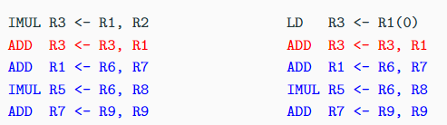
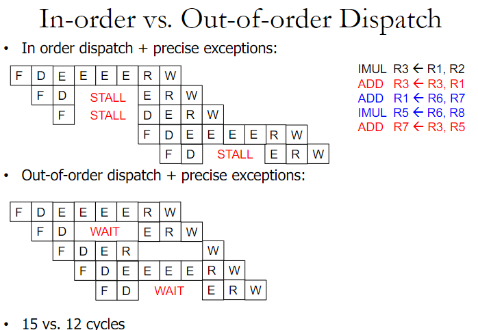
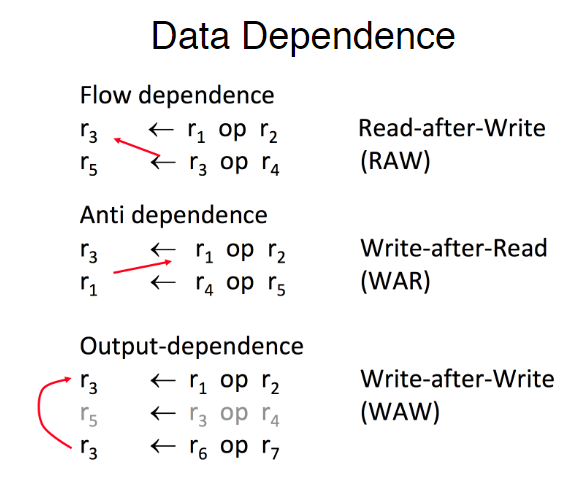
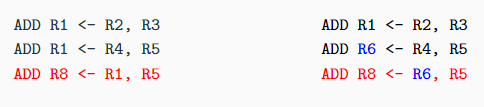
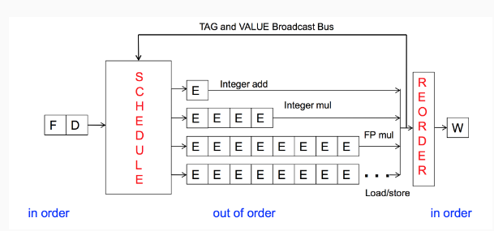
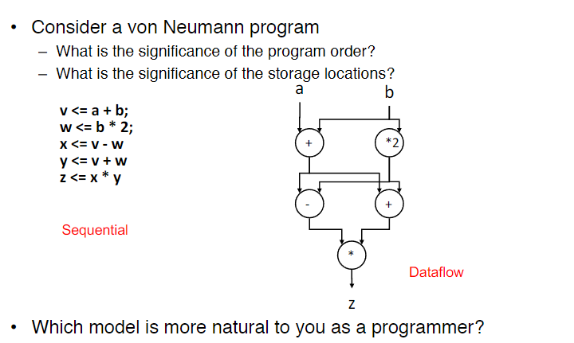
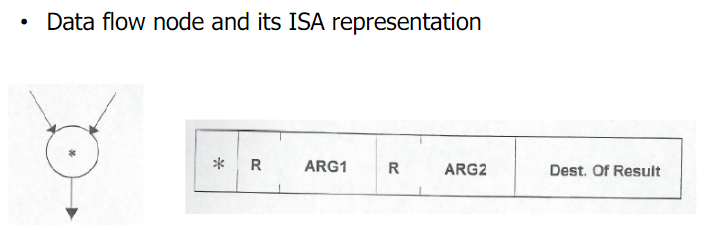

<!-- pandoc example.md -o example.pdf -->

## Lecture 10: Out-of-Order Execution

### In-Order Pipelines

A true data dependency stalls *dispatch* of younger instructions into functional (or execution) units. I.e, the instruction is not dispatched until the data is available.

**Dispatching** an instruction is the act of sending that instruction to a functional unit for execution.

### Know the Enemy

What do the two pieces of code have in common with respect to execution in the previous design? The `ADD` stalls the entire pipeline. This is because `ADD` cannot dispatch since own of its operands is not available; because of this later *independent* instructions cannot get executed.

Additionally, the load latency is variable, meaning we don't know if it'll be a cache hit or miss until run time. This is present in the `LD R3 <- R1(0)` code. This instruction introduced a variable load latency since the time it takes to complete the load operation varies depending on whether the data is available in the cache or needs to be fetched from memory. What does this affect? One can be solved by the compiler, the other requires microarchitectural support.

### Preventing Dispatch Stalls

We've already covered two ways to prevent dispatch stalls:

- Fine-grained multithreading:
  
  Also known as interleaved or simultaneous multithreading, it's a technique that processors use to minimalize stalls. The CPU interleaves instructions from multiple threads or processes within a single pipeline. By switching between different threads each cycle, the processor mitigates the impacts of stalls affecting any single thread.

  I.e., each cycle, the processor can choose to execute an instruction from a different thread. The interleaving means while one thread is stalled (waiting for data, resolving a branch, etc.) it could work on a different thread's needs by putting it through the pipeline resources.

- Compile-time instruction scheduling/reordering:
  
  This is a technique used by compilers to rearrange the sequence of instructions during compile. Recall, that data hazards can occur when instructions close together in the program depend on each other. The compiler can rearrange instructions so that independent instructions are placed between dependent ones. This reordering gives the CPU enough time to complete data-producing instructions before the results are needed by subsequent instructions.

  To avoid structural hazards, the compiler could analyze the CPU's resource availability and the resources needed for each instruction, and then schedule instructions in a way that balanceds the load on different resources.

  For control hazards, compilers can use branch prediction at compile to guess the likely outcome of conditional branches and rearrange instructions accordingly.

**However, they have two key disadvantages. The first one requires thread saturation, and the second one is not dynamic.** I.e., the first one requires a lot of threads to be running to be effective, and the second one is not able to adapt to the dynamic nature of the program.

We can improve this using **Out-of-Order Execution**.

### Out-of-Order Execution (Dynamic Scheduling)

The key idea is to move the dependent instructions out of the way of independent instructions. We could add *rest areas* for dependent instructions.

We then monitor the *source values* of each instruction in the rest area. When all *source values* of an instruction are available, dispatch the instruction. In OoOE, **source values** refer to the operands needed by an instruction to execute. These could be values stored in registers or locations that an instruction may need to read from before it can execute. Monitoring these values helps the CPU determine when an instruction is ready to be dispatched.

**Note, the reason there are 4 "E"s is because IMUL is a complex and time consuming operation.** As seen in the figure above, The second instruction is moved to a wait area, then the third instruction runs, then the second instructions get re-dispatched once the first instruction is done.

### Data Dependence

However, with the introduction of OoOE, we need to be careful with data dependence. Data dependence is a relationship between instructions in which an instruction depends on the result of a previous instruction. There are three types of data dependence:

- RAW (Read After Write): The second instruction reads a value that the first instructions writes, but the first instruction has not yet written the value.
- WAR (Write After Read): The second instruction writes a value that the first instruction reads, but the first instruction has not yet read the value. This wasn't possible before in a ordered pipeline.
- WAW (Write After Write): The second instruction writes a value that the first instruction writes, but the first instruction has not yet written the value.

### Register Renaming

Both WAR and WAW are known as **name dependence**. This is because the two instructions are writing to the same register, and because there's no value being transmitted between the two instructions. Since a name dependence is not a true data dependence, instructions involving the same name dependence can execute simultaneously, or be reordered, if the name used in the instructions is changed so the instructions don't conflict.

Register renaming can be done either statically by a compiler or dynamically by the hardware.

As seen in the picture above, two instructions write to the same register. `R1` can be renamed to `R6` to remove this name dependence. This allows the two instructions to be executed simultaneously.

### Overview of OoOE

As we can see in the figure above, only the execution stage is out of order. The fetch, decode, and commit stages are still in order. This is because the fetch and decode stages are not dependent on the execution stage, and the commit stage is dependent on the execution stage.

Additionally, there is a bonus scheduling stage where decoded instructions are dynamically scheduled for execution based on the availability of resources. There are also various execution units for different types of operations. Each unit can execute instructions independently and OoO, meaning they don't have to wait for the other units to finish executing an instruction.

The TAG and VALUE bus is used for communication between the execution units and the reorder buffer. It broadcasts the results of the executed instructions plus their tags so other units and the reorder buffer can update their values and tags accordingly.

The reorder buffer stage is where the results of the executed instructions are reordered to ensure that they're committed in the original program order since this is crucial for maintaining the correct execution sequence and handling exceptions correctly.

### Dataflow Model

The dataflow model is a model of computation that describes a program as a directed graph of operations. Each node in the graph represents an operation, and each edge represents a data dependency between operations. The dataflow model is used to describe the flow of data through a program and to determine the order in which operations should be executed.

Von Neumann Model: Instructions are fetched and executed in a *control flow order*. I.e., the order in which they appear in the program. This model is used in most modern computers.

Dataflow Model: Instructions are fetched and executed in *dataflow order*. Meaning they execute when operands are ready, there are no *instruction pointers*. Instruction ordering specified by data flow dependence, each instruction specifies who should receive the result, an instruction can *fire* whenever all operands are received. There is huge potential for many instruction to execute in parallel.

**Instruction Pointer** is analogous to the program counter.

The main difference between the von Neumann model and the Dataflow model lies in how and when instructions are executed within a computing system.

#### In other words

**Von Neumann Model:** In this traditional model, instructions are executed sequentially as dictated by the instruction pointer. This means that each instruction waits for the previous one to complete before it can begin, regardless of whether the data it needs is already available. This can lead to inefficiencies, especially if some instructions are ready to execute but must wait due to the sequential nature of the process.

**Dataflow Model:** Contrary to the von Neumann model, the Dataflow model executes instructions as soon as all their operands are available, without following a strict sequential order. This model does not use an instruction pointer. Instead, instructions are triggered by the availability of input data, allowing multiple instructions that are not dependent on each other to execute in parallel, which can significantly increase efficiency and speed.

**Analogy:**
Imagine you are cooking a meal with several dishes. In a von Neumann model, you would cook each dish one at a time, completing one before starting the next, regardless of whether some dishes could be prepared simultaneously. In contrast, the Dataflow model is like having multiple chefs in the kitchen, each working on different parts of the meal as soon as the ingredients they need are available. This way, all dishes are being prepared concurrently, speeding up the overall cooking process.

### More on Dataflow

In a dataflow machine, programs consist of data flow nodes. Data flow nodes fire (fetch and execute) when all their input data is available. The data flow model is inherently parallel, as multiple nodes can fire simultaneously as long as their input data is ready.

Note, they use a completely different architecture than the von Neumann model.

Advantages:

- Very good at exploiting irregular parallelism
- Only real dependencies constrain processing (RAW)

Disadvantages:

- No precise state (hard to debug)
