<!-- pandoc example.md -o example.pdf -->

<!-- ## Lecture 3: The Idea of the CPU

### The Stored Program Computer

Program lives in computers as data; it is a series of bits living within memory as a series of discrete "instructions." The CPU is responsible for fetching these instructions from memory and executing them. It does this using the program counter (PC); the PC points to the current instruction to be executed. The CPU fetches the instruction at the address pointed to by the PC, increments the PC, and then executes the instruction.

As we all know, not all programs run straight from start to finish; sometimes, programs need to repeat a section of code (like in a loop) or skip over parts like with an if statement. When this happens, special instructions (like jump, branch, or call instructions) change the value of the program counter. Instead of moving to the next sequential instruction, the PC jumps to a different address where the needed code is located.

### The Instruction Set Architecture (ISA)

The ISA is the set of instruction a computer can execute. All programs are combinations of these instructions. It's an abstraction that programmers (and compilers) use to express computations.

**I.e., the ISA defines a set of operations, their semantics, and rules for their use. The software then agrees to follow these rules.**

The hardware can implement those rules in any way it chooses. It can do this directly in the hardware, via a software layer (like a virtual machine), via a trained monkey with pen and paper, etc.

### The MIPS ISA

MIPS, microprocessor without interlocked pipelined stages, is a family of reduced instruction set (RISC) ISAs. According to the slides, MIPS is:

- Simple, elegant, and easy to implement
- Designed with the benefit of hindsight; many years of ISA design experience went into it
- Designed for modern programmers, tools, and applications

x86, the ISA used by Intel and AMD, is a complex instruction set computer (CISC) ISA. It's a bit of a mess, but it's a mess that's been around for a long time and has a lot of software written for it. According to the slides, x86 is:

- Ugly, messy, inelegant, cruft, arcane, very difficult to implement
- Designed for 1970s technology
- Nearly the last in long series of unfortunate ISA designs
- The dominant ISA in modern computer systems

### MIPS Basics

Many instructions in MIPS is 4 bytes (32 bits), 4-byte aligned. With it being aligned it multiples of 4, they start at addresses that are a multiple of 4; e.g., 0x0000, 0xx0004, etc. The Instructions operate on memory and registers.

Memory data types are also aligned. Bytes are 8 bits, half-words are 16 bits, words are 32 bits, and double words are 64 bits. Memory is denoted "M"; e.g., M[0x10] is the byte at address 0x10.

Within MIPS, there are 32 4-byte registers within the register file. The registers are denoted "R"; e.g., R[0] is register 0, R[1] is register 1, etc.

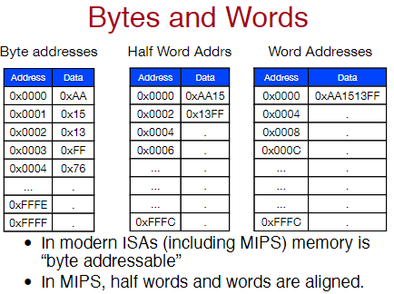

Notice in the chart, the address multiples. The address of a word is a multiple of 4, the address of a half-word is a multiple of 2, and the address of a byte is any address. Half words and words within MIPS are aligned.

### MIPS Register File

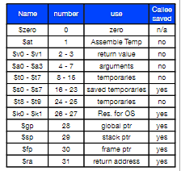

Within MIPS, all registers are the same. Meaning, where a register is needed, any register can be used. By convention, they're used for particular tasks. For example, R[0] is always 0, R[31] is the return address, R[29] is the stack pointer, etc. Writes to R[0] are ignored, and reads from R[0] always return 0. -->

## Memory Book Reading

### 2.1 Introduction

Not all memory is created equally. Although many programmers desire unlimited amounts of fast memory, the reality is that memory is expensive. The faster the memory, the more expensive it is. The slower the memory, the cheaper it is. The memory hierarchy is a way to balance the need for speed and the need for cost. It takes advantage of locality and trade-offs in the cost-performance of memory technologies.

*The principle of locality* states that most programs do not access all code or data uniformly. More specifically, locality occurs in time (temporal locality) and space (spatial locality).

- Temporal locality is the idea that if a memory location is referenced, it will tend to be referenced again soon. Think of a loop; the same memory locations are accessed over and over again.
- Spatial locality is the idea that if a memory location is referenced, nearby memory locations will tend to be referenced soon. Think of an array; if you access one element, you'll likely access the next element soon after.

This principle plus the guideline that for a given implementation technology and power budget, smaller hardware can be made faster led to hierarchies based on memory of different speeds and sizes.

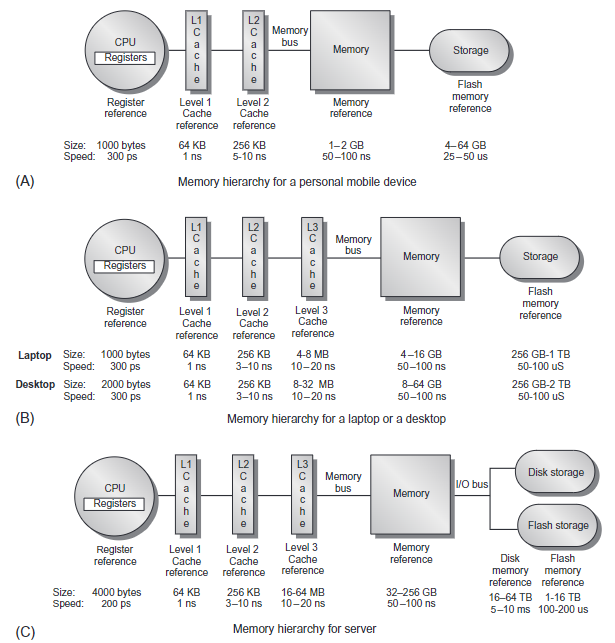

The figure above shows several different multilevel memory hierarchies. As Flash and next-gen memory technologies continue to close the gap with disks in cost per bit, such technologies are likely to replace magnetic disks for secondary storage.

Recall that fast memory is expensive; therefore memory hierarchies are organized into several levels with each being smaller, faster, and more expensive per byte than the next lower level. The lower the level, the farther away from the processor it is.

**The goal is to provide a memory system with a cost per byte that's almost as low as the cheapest level of memory and a speed almost as fast as the fastest level.**

In most cases (but not all), the data contained in a lower level are a superset of the next higher level. For example, the L2 cache will have a copy of all the data in the L1 cache, and the main memory will have a copy of all the data in the L2 cache. This property, called the *inclusion property*, is always required for the lowest level of the hierarchy.

The importance of the MH has increased with advanced in performances of processors.

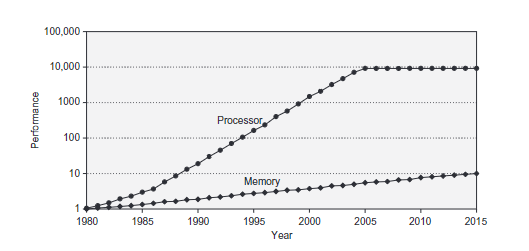

The figure above plots single processor performance projections against the historical performance improvement in time to access main memory. The gap between processor and memory performance has been increasing over time. This gap is a major factor in the design of modern computer systems.The processor line shows the increase in memory requests per second on average, while the memory line shows the increase in DRAM accesses per second. **I.e., the pace at which processors are getting faster is outscaling the pace at which we can access memory.**

### Basics of MH

The bulk of this chapter describes more advanced innovations that attack the processor-memory performance gap.

When a word is not found within the cache, the word must be fetched from a lower level in the hierarchy (which may be another cache or the main memory) and placed into the cache before continuing. Multiple words, called a *block* or *line*, are moved at the same time for efficiency reasons since they are likely to be needed due to spatial locality. Each *cache block* includes a *tag* to indicate which memory address it corresponds to.

A key design decision is where *blocks* can be placed within a cache. The most popular scheme is **set associative**, where a *set* is a group of blocks in a cache.

Blocks are first mapped onto a set, then the block can be placed anywhere within that set. Finding a block consists of first mapping the block address to the set, then searching the set (usually in parallel) to find the block. The set is chosen by the address of the data:

$$\text{Block address} \% (\text{Number of sets in a cache})$$

If there are *n* blocks within a set, the cache placement is called *n-way set associative.* The endpoints of set associativity also have their own names (direct-mapped and fully associative). The former is when there's only one block per set, and the latter is when there's only one set. Direct mappped caches must always be placed in the same location, while fully associative caches can be placed anywhere.

Caching data that is only read is easy because the copy in the cache and memory is identical, but what if we want to write? The copy in the cache and memory must be consistent with one another. There are two main strategies for handling writes:

- A write-through cache updates the item in the cache and writes through to update to main memory. No write-backs are required on eviction which is a bonus.
  This leads to higher bandwidth usage because every write operation results ina memory write, regardless of how often that data is accessed. However, no writebacks are required on eviction.

- Write-back caches only update the copy in the cache. When a block is about to be replaced, it is copied back to memory. Fewer writes down the hierarchy and less bandwidth (meaning more things can be done). However, write-backs are required on eviction.

Both strategies can use a write buffer to allow the cache to proceed as soon as the data replaced in the buffer rather than wait for full latency to write the data in memory.

One measure of the benefits of different cache organizations is the *miss rate*. *Miss rate* is simply the fraction of cache accesses that result in a miss divided by the number of accesses. Cache misses are the accesses that result in a miss, and cache hits are the accesses that result in a hit. **To explain more simply, cache misses occur when the processor goes to look for data in the cache and doesn't find it there.**

To gain insights into the causes of high miss rates, the three Cs model sort all misses into three simple categories:

- *Compulsory*: The very first access to a block cannot be in the cache, so the block must be brought into the cache. This is also called a cold start miss. These kinds of misses will always occur, even if we have an infinite-sized cache.
- *Capacity*: The cache cannot contain all the blocks needed during executing of a program. This is also called a capacity miss. These kinds of misses in addition of compulsory misses will occur because of blocks being discarded and later retrieved.
- *Conflict*: If the block placement strategy is not fully associative, then there will be conflict misses. Recall, fully associative is when there's only one set, and cache blocks can be placed anywhere. These occur because a block may be discarded and later retrieved if multiple blocks map to its set and accesses to the different blocks are intermingled.

**Imagine you have a small bookshelf right next to your bed (this is the cache) where you can only fit a certain number of your favorite books for easy access. However, your entire book collection is in a larger bookcase in another room (this represents the main memory).**

**Compulsory Miss (Cold Start Miss):**
**When you want a specific book for the first time, it's not on your small bookshelf because you've never read it before. So, you have to go to the large bookcase to get it. This first time you fetch the book, it's a "compulsory miss" because the book was never in the small bookshelf to begin with. It's like starting with an empty bookshelf; no matter how big it is, if you haven't put anything there yet, you have to go get it from the larger bookcase.**

**Capacity Miss:**
**Now, imagine your small bookshelf gets full because you have a lot of favorites. When you want to add a new favorite book, you need to remove an old one to make space. If later you want to read one of the books you took out, you'll have to go back to the large bookcase to get it. This is a "capacity miss" because your small bookshelf (the cache) doesn't have enough room to hold all the books you want to access during your reading time.**

**Conflict Miss:**
**Let's say your small bookshelf is divided into sections, and each type of book has to go into its designated section (this represents the set-associative or direct-mapped organization of the cache). If you have more mystery books than sections and you keep wanting to switch between them, you might have to keep swapping them in and out because they all need to fit into the same part of the shelf. When you remove a mystery book to make space for another but then need it back later, you encounter a "conflict miss" because the organization of your bookshelf forces you to remove books even though there might be space elsewhere on the shelf.**

Note, miss rates can be misleading measure for several reasons. Therefore some designers prefer measuring misses per instruction rather than misses per memory reference (miss rate). They're related as follows:

$$\frac{\text{Misses}}{\text{Instruction}} = \frac{\text{Miss rate} \times \text{Memory accesses}}{\text{Instruction Count}} = \text{Miss rate} \times \frac{\text{Memory accesses}}{\text{Instruction}}$$

However, the problem with both measures is that they don't factor in the cost of a miss. A better measure is the **average memory access time.** It's calculated as follows:

$$AMAT = \text{Hit time} + (\text{Miss rate} \times \text{Miss penalty})$$

Where *hit time* is the time to hit in the cache and the *miss penalty* is the time to replace the block from memory, i.e., the cost of a miss. There are several basic cache optimizations that we can perform to reduce the miss rate and miss penalty. First we have to define static and dynamic power. Static power is the power consumed by the cache when it's not being actively read or written to. Dynamic power occurs when the cache is being actively used. These include:

- Larger block sizes to reduce miss rate: The simplest way to reduce the miss rate is to take advantage of spatial locality and increase the block size. Larger blocks will reduce compulsory misses, but they also increase the miss penality. This is because the larger the block, the more data that needs to be fetched from memory when a miss occurs.
  
  As a result larger block sizes can also increase capacity or conflict misses, especially in smaller caches. Choosing the right block size is a complex trade-off that depends on the size of the cache and the miss penalty.

- Bigger caches to reduce miss rate: The obvious way to reduce capacity misses is to increase cache capacity. The drwaback includes a potentially longer hit time of the larger cache memory and higher cost and power.
- Higher associativity to reduce miss rate: We can increase the associativity to reduce conflict misses. Recall, the higher the associativity, the more blocks can be placed within a set. The drawback is that higher associativity increases the hit time because more blocks need to be searched in parallel.
- Multilevel caches to reduce miss penalty: Designers have to ask themselves if they want to make the hit time faster the following question: Do they want to keep pace with the high clock rate of processors, or to make the cache large to reduce the gap between processor accesses and main memory accesses?
  
  Adding another level of cache between the original cache and memory simplifies this decision. The L1 cache can be small enough to match a fast clock cycle time, yet the L2 or L3 cache can be larger to capture many accesses that would go to main memory. The focus on misses in L2 caches lead to larger blocks, bigger capacity, and higher associativity.

  We can redefine the AMAT equation to account for multiple caches as follows:

  $$AMAT = \text{HT}_{\text{L1}} + \text{MR}_{\text{L1}} \times (\text{HT}_{\text{L2}} + \text{MR}_{\text{L2}} \times \text{MP}_{\text{L2}})$$
  
  Where the miss penalty is the average time to access the next lower level of the hierarchy. The equation can be continued infinitely for more levels of cache.

- Giving priority to read misses over writes to reduce miss penalty: A write buffer is a good place to implement this optimization. Write buffers create hazards because they hold the updated value of a location needed on a read miss, that is, a read-after-write hazard through memory.
  
  One solution is to check the contents of the write buffer on a read miss. If there are no conflicts, and if the memory system is available, send the read before the writes reduces the miss penalty.

  **Giving Priority to Read Misses Over Writes:**
  **Imagine you're playing a video game and you have two types of messages you can send to your friends: a quick update (write) and a question (read). Now, the rule is, you can only send one message at a time.**
  
  **If you always send your updates first, and then ask your questions, you might end up waiting a long time for answers because your questions are stuck behind all your updates. This can be annoying, especially if you really need the answer to continue the game.**
  
  **So, what if we change the rules? Now, whenever you have a question, you send it out before sending any updates. This way, you get your answers faster, and you can keep playing the game smoothly. In your computer, "reading" is like asking a question (you want to get data), and "writing" is like sending an update (you want to store data).**
  
  **A "write buffer" is like a notepad where you jot down your updates before you send them out. If you have a question but also have updates waiting to go out, you can check your notepad quickly to see if any updates are about your current question. If not, you send your question first to get the answer quickly, then send your updates later.**
  
  **This makes your gaming (or computing) experience better because you're not waiting as long for important answers, allowing you to continue playing (or processing) without unnecessary delays.**

- Reducing the miss penalty with critical word first: The critical word first optimization is a way to reduce the miss penalty. The idea is to fetch the critical word first, then the rest of the block. The critical word is the word that the processor needs to continue executing the instruction that caused the miss. This optimization is especially useful for write-back caches.

  **Reducing the Miss Penalty with Critical Word First:**
  **Imagine you're reading a book, and you're on a page that has a word you need to understand the rest of the story. You don't have the whole book with you, so you have to go to the library to get it.**
  
  **Now, you could go to the library and get the entire book, but that would take a long time. Instead, you decide to go to the library and get only the page you need. This way, you can continue reading the story while the rest of the book is being fetched.**
  
  **In your computer, the "critical word" is like the word you need to understand the rest of the story. When you have a cache miss, you want to get the critical word first so you can continue processing the instruction that caused the miss. Then, you can get the rest of the block while the processor is still working.**

- Avoid address translation during indexing of the cache to reduce hit time: Caches must cope with the translation of a virtual address from the processor to a physical address to access memory. A common optimization is to use the page offset - the part that's indetical in both virtual and pyhsical addresses- to index the cache.
  
  The virtal index/physical tag method introduces overhead and/or limitations on the size and structure of the L1 cache, but it allows us to remove the TLB access from the critical path.

## Lecture 4: Review of Memory Hierarchy

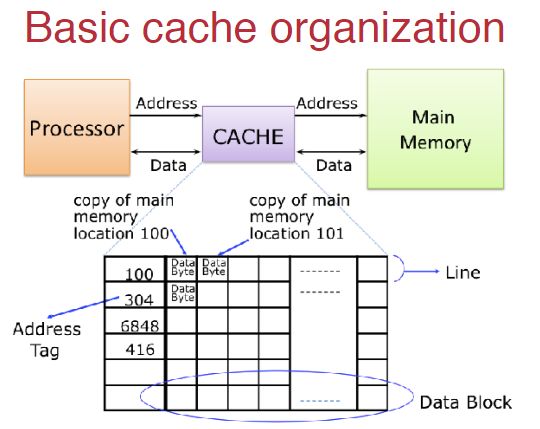

### Cache Geometry Calculations

Addresses within the cache break down into three parts: the tag, the index, and the block offset. **How much of each part used within the address depends on the cache geometry.** We'll refer to the following variables in the calculations:

- Number of cache lines (L)
- Cache Line Size (B)
- Address Length (A); 32 bits is the usual in this course
- Associativity (W)

The index, offset, and tag bits are calculated as follows:

- **Index Bits (I):** $\log_2(L/W)$
- **Offset Bits (O):** $\log_2(B)$
- **Tag Bits (T):** $A - (I - O)$

Sets are calculated as follows:

- **Number of Sets (S):** $L/W$
- **Number of Blocks per Set (N):** W

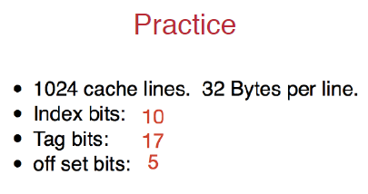

### Where do we place data within a cache?

Recall associativity. The associativity of a cache is the number of blocks that can be placed within a set.

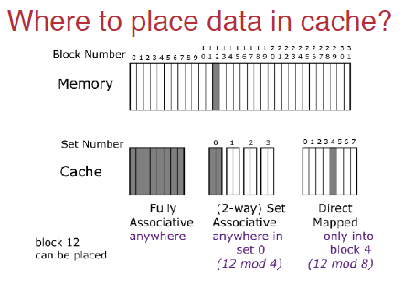

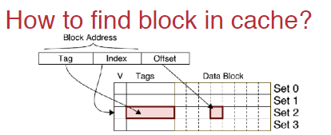

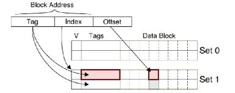

**Overall, we calculate the index to figure out which set the data will be placed in. Next, the tag determines where in the set the block is, while the offset is the specific memory location we want to access it.**

### Cost of Associativity

Increasing the associativity requires multiple tag checks. *N-way* associativity requires *N* parallel comparators. This is expensive in hardware and potentially slow.

Overall, this limits the associativity of L1 caches to about $2-8$. Larger, slower caches can be more associative.

### Write allocate/no-write allocate

If the cache allocates cache lines on a write miss, it is write allocate, otherwise, it's no write allocate.

- Write allocate advantages: Exploits temporal locality; data written will be read soon and that read is faster.
- No-write allocate advantages: Fewer spurious evictions. If the data is not read in the near future, the eviction is a waste.

### Eviction in Associative Caches

When conflict misses occur, we must choose which line in a set must be evicted. How we choose is called *the cache eviction policy:*

- Random: Simple, but not very effective.
- LRU (Least Recently Used): Most effective, but also most complex. It requires a counter for each block in the set to keep track of the order of access. This is expensive in hardware.
- Prefer Clean: Evict clean blocks first. This is useful for write-back caches.

### Cache Line Sizes

How big should cache lines be? How big or how small?

- Bigger better: Exploits spatial locality. Large cache lines effectively prefetch data that we've not explicitly asked for.
- Smaller better: Focuses on temporal locality. If there is little need for spatial locality, large cache lines waste a lot of space and bandwidth.

### Data vs. Instruction Caches

Why would we have different caches for instructions and data? The main reason is that instructions and data have different access patterns.

- Instrunction caches have a lot of spatial locality. Instructions are executed sequentially, so the next instruction is likely to be nearby.
  Additionally, instruction caches are also more predictable to the extent that branches are predictable.
  Data cache caccesses are typically less predictable.

## Lecture 5: Advanced Cache

Recall, direct-mapped caches have one block per set, and fully associative caches have one set. The number of blocks per set is called the associativity.

- Number of cache lines (L)
- Cache Line Size (B)
- Address Length (A); 32 bits is the usual in this course
- Associativity (W)

The index, offset, and tag bits are calculated as follows:

- **Index Bits (I):** $\log_2(L/W)$
- **Offset Bits (O):** $\log_2(B)$
- **Tag Bits (T):** $A - (I - O)$

Sets are calculated as follows:

- **Number of Sets (S):** $L/W$
- **Number of Blocks per Set (N):** W

**One thing to note is the calculates give bits. Addresses are given in hexadecimal. 1 hexadecimal = 4 bits.**

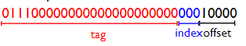

### Reducing Compulsory Misses

Increasing the cache line size allows the processor to request bigger chunks of memory. This only works if there is good spatial locality, otherwise we're brining in data we don't need and wasting space.

I.e., if we're reading a few bytes here anda few bytes there (no spatial locality) this hurts performances. But helps in cases like the following:

```c

for (i = 0; i < 100000000; i++) {
  sum += data[i];
}

```

#### Prefetching

Other than increasing the cache size to reduce compulsory mises, we could *prefetch.* We speculate on future instruction and data accesses and fetch them into the cache. Instruction accesses are easier to predict than data accesses. There are several variations of prefetching:

- Hardware prefetching
- Software prefetching
- Mixed hardware/software prefetching

```c

for (i = 0; i < 100000000; i++) {
  sum += data[i];
}

```

In this case, the processor could identify the pattern and proactively fetch data the program will ask for. The pattern is: $\text{nextAddr} = \text{curAddr} + 4$.

#### Hardware Prefetching and Software Prefetching

- Prefetch-on-miss: We could prefetch $b+1$ upon miss on $b$. We could initiate a one block lookahead scheme where we would initiate a prefetch for block $b+1$ when block $b$ is accessed. We could extend to $N$-block lookahead. If observed sequences of accesses to block $b$, $b+1$, $b+2$, etc., we could prefetch $b+1$, $b+2$, $b+3$, etc.

There are several issues with prefetching those. For example, if we prefetch too much, we could evict useful data. If we prefetch too little, we could waste bandwidth. Timing is the biggest issue, not predictability when it comes to prefetching.

### Reducing Conflict Misses

Conflict misses occur when the data we need was in the cache previously, but got evicted. Recall, these evictions occur when:

- Direct-mapped: another request mapped to the same cache line
- Associative: too many requests mapped to the same set

Example:

```c
while (1) {
    for (i = 0; i < 100000000; i += 4096) {
        sum += data[i];
    }
}
```

In this case, the program is accessing data in a stride of 4096 bytes. This is a conflict miss because the cache line is constantly being evicted and replaced with the next cache line.

There are several ways to reduce these conflict misses:

- Colliding Threads and Data
  
  The stack and heap tend to be aligned to large chunks of memory (around 128 MiB or more). Threads often run the same code in the same way. This means that thread stacks will end up occuping the same parts of the cache. We could try to randomize the base of each thread's stack.

  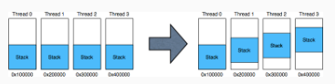

  Outside of thread randomization, large data structures (like arrays) are also often aligned. Randomizing malloc could also help by making the array be reallocated to a different part of the memory.

### Reducing Capacity Misses

Capacity misses occur when the processor is trying to access too much data. Some terminology is needed to understand the concepts laid out in this section.

- *Working Set:* The data that's currently important to the program.

If the working set is bigger than the cache, you're going to miss frequently. Capacity misses are harder to measure:

- Easiest definition: Non-compulsory miss rate in an equivalently-sized fully associative cache.
- Intuition: Take away the compulsory misses and the conflict misses, and what're you have left are capacity misses.

We can mitigate capacity misses by:

- Increasing cache capacity
- Increasing associativity; however this costs area and makes the cache slower
- Tiling
  
  Say we have an application that needs to do several passes over a lagre array. Doing each pass in turn blows out our cache.

  Blocking or tiling the loops will prevent the blowout, but whether or not it's possible to do so depends on the structure of the loop.