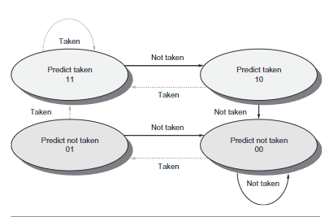

<!-- pandoc example.md -o example.pdf -->

## Lecture 9: Handling Branches

### Fine-Grained Multithreading

Idea: Hardware has multiple thread contexts. Each cycle, the fetch engine fetches from a different thread.

By the time the fetched branch/instruction resolves, no instruction has been fetched from the same thread. The branch/instruction resolution latency is overlapped with execution of other thread's instructions.

Pros: No logic is needed for handling control and data dependencies within a thread.

Cons:

- Single thread performance suffers
- Extra logic for keeping thread contexts
- Latencies do not overlap if there are not enough threads to cover the whole pipeline.

I.e., the hardware maintains the state of multiple threads simultaneously. The processor switches between threads without needing to save/restore the state each time.

Additionally, the fetch engine hides the latency of instruction fetches and execution because while one thread is waitinf for its instruction to be fetched or executed, another thread's instruction can be processed.

The key advantage is the ability to overlap the branch/instruction resolution latencies with the execution of instructions from other threads. The processor is never idle while waitinf for an instruction to be resolved since it can continuously execute other instructions from other threads.

### Branch Prediction

As pipelines get deeper and the potential penalty of branches increase (since more stages will be delayed), using delayed branches and similar schemes are not enough. Instead of passively creating a slot for the branch, we can actively predict the outcome of the branch. Such schemes fall into two categories: low-cost static schemes that rely on information available at compile time and strategies that predict branches dynamically based on program behavior.

#### Static Branch Prediction

One way to improve compile-time branch prediction is to use profile information collected from earlier runs. The key observation that makes this work is that the behavior of branches is often bimodally distributed; meaning, an individual branch is often highly biased towards taken or untaken.

The effectiveness of any branch prediction scheme depends both on the accuracy of the scheme and the frequency of conditional branches. The fact that the misprediction rate for the integer programs is higher and such programs typically have a higher branch frequency is a major lmitation for static branch prediction.

#### Dynamic Branch Prediction and the Branch Prediction Buffer (BPB)

Simplest dynamica branch-prediction scheme is the BPB or *branch history table*. It's a small memory indexed by the lower portion of the address of the branch instruction. The memory contains a bit that says whether the branch was recently taken or not. This scheme is the simplest sort of buffer; it has no tags and is useful only to reduce the branch delay when it's longer than the time to compute the possible target PCs.

With such a buffer though, we don't know if the prediction is correct. It may have been put there by another branch that has the same low-order address bits. Surprisingly, this doesn't matter. The prediction is a hint that's assumed to be correct, and fetching begins in the predicted direction. If the hint turns out wrong, the prediction bit is inverted and stored abck.

This buffer is effectively a cache where every access is a hit; the performance of the buffer depends on both how of the prediction is for the branch of interest, and how accurate the prediction is when it matches.

This simple 1-bit prediction scheme has a performance shortcoming: even if a branch is almost always taken, we will predict incorrectly twice rather than once, when it is not taken, since the mis prediction causes the prediction bit to be flipped.

To remedy this weakness, 2-bit prediction schemes are often used. In a 2-bit scheme, a prediction must miss twice before it's changed. A FA is shown below:

The 2-bit scheme is more accurate than the 1-bit scheme, but it's also more complex. The 2-bit scheme is also more sensitive to the history length. The longer the history, the more accurate the prediction.

## 3.3 Reducing Branch Costs with Advanced Branch Prediction

Because of the need to enforce control dependence through branch hazards and stalls, branches hurt pipeline performance.