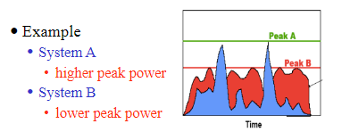
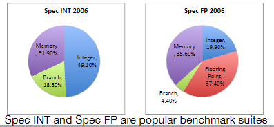
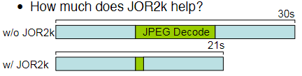
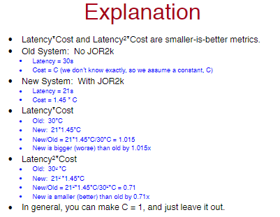

<!-- pandoc example.md -o example.pdf -->

## Lecture 2: Performance Metrics

### Latency

When it comes to computer architecture, *latency* is the most common metric. It's calculated as follows:

$$\text{Speed} = \frac{1}{\text{Latency}}$$

*Latency*, or *response time*, is the time between the start and completion of an event, such as milliseconds (ms) for a disk access. More specifically, it's the time it takes from when a request is made by the user and the time the response is received.

One thing to note however, "performance", usually but not always, means latency.

All CPUs have some form of latency, which is the delay before a transfer or operation begins following an instruction. However, we're generally focused on the latency of the application acting on a specific CPU. In this context, application latencyc is influenced by various factors beyond the CPU's basic operation latency, such as application ode efficiency, the interaction with other system copmonents like memory and storage, network, and task complexity.

Latency is critical for many applications, especially those that require real-time processing, such as video streaming, gaming, and financial trading. For example, a high-frequency trading application may require a latency of less than 1 millisecond to be competitive.

### Speedup

*Speedup* is the ratio of two latencies. It's calculated as follows:

$$\text{Speedup} = \frac{\text{Latency}_{\text{old}}}{\text{Latency}_{\text{new}}}$$

From this equation it's obvious that if speedup is greater than 1, that means performance increased, and if it's less than 1, performance decreased. **Higher latency is bad.**

Speedup (and other ratios of metrics) allow the comparison of two systems without reference to an absolute unit. 

### Throughput and Bandwidth

*Throughput* is another word for *bandwidth*. It's the number of tasks completed per unit of time. For example, a disk's throughput is the number of I/O operations it can perform per second. It's independent from the exact total number of tasks. It's important in systems where the number of tasks is not fixed, such as data center servers, and high-performance computing.

From a historical perspective, improving latency has always lagged behind improving throughput. This is because throughput is easier to improve. For example, a CPU can be made faster by adding more cores, but it's harder to make a single core faster.

*Bandwidth problems can be cured with money, latency problems are harder because the speed of light is fixed. You can't bribe God.*

Additionally, *some jobs are just hard to parallelize.* Paralleization is the process of dividing a task into smaller, often independent sub-tasks that can be executed simultaneously, and then combining the results of the sub-tasks to produce the final output. Some tasks are inherently serial, meaning they can't be parallelized. For example, a task that requires the result of a previous task to be completed before it can start.

### Power

Energy is measured in Joules (J), and power is measured in Watts (W). Power is the rate at which energy is consumed. It's calculated as follows:

$$\text{Power} = \frac{\text{Energy}}{\text{Time}}$$

From these kinds of graph, we integrate the power curve to get the energy consumed.

### Derived Metrics

Often, we care about multiple metrics at once. For example:

Bigger is better:

- Bandwidth per dollar; this is important for networking. $\frac{GB/s}{ \$ }$
- Bandwidth per watt; this is important in memory systems. $\frac{GB/s}{W}$
- Work/Joule; this is important in supercomputing. $\frac{\text{instructions}}{\text{Joule}}$

Smaller is better:

- Cycles/Instruction; time per work.
- Latency * Energy; energy delay product. Mobile systems must balance latency (delay) and battery (energy) usage for computations. The EDP is a "smaller is better" metric.

In general, multiply by big-is-better metrics, divide by smaller-is-better.

In generael, there is not a universally correct metric. We can use any emtric we like to evaluate a system, but we must be careful to use the right metric for the right situation. We want to be asking ourselves, what does the computer need to accomplish? What constraints is it under?

### Benchmarks

Now that we have the metrics, how do we compare different architectures? Benchmarks. Benchmarks help us make comparable measurements. A benchmark suite is a set of programs that are representative of a set of problems:

- Server computing (SPECINT)
- Scientific computing (SPECFP)

Like before, there is no "best" benchmark suite simply because there are so many different problems.

There are two types of benchmarks: microbenchmarks and kernel benchmarks. Microbenchmarks are small, simple programs that measure a specific feature of a system. Kernel benchmarks are larger, more complex programs that measure a system's performance on a real-world application.

### The CPU Performance Equation

If we want to know how an architecture impacts performance, we need to quantify performance in terms of architecture parameters such as:

- Instruction Count (IC); the number of instructions the CPU executes.
- Cycles per Instruction (CPI); the average number of cycles per instruction. I.e., the ratio of cycles for execution to the number of instructions executed.
- Cycle Time; the length of a clock cycle in seconds.

From these parameters, it brings us the first fundamental theorem of computer architecture:

$$\text{Latency} = \text{Instruction Count} \times \frac{\text{Cycles}}{\text{Instruction}} \times \frac{\text{Seconds}}{\text{Cycles}}$$

$$\text{L} = \text{IC} \times \text{CPI} \times \text{CT}$$

Good models will give insights into the system they model. For example, from this equation, we know latency changes linearly with IC, CPI, and CT. This is useful for understanding how to improve performance. This gives us several ways to improve performance:

- Reduce the number of instructions executed (IC).
  
  The instruction count in the performance equation si the *dynamic* instruction count. Dynamic has to do with the execution of the program or counted at run time. This accounts for the fact that some instructions are executed more than once. For example, a loop that executes 100 times will have a dynamic instruction count of 100 times the number of instructions in the loop. The dynamic instruction count is the number of instructions executed by the program, not the number of instructions in the program.

  Static instruction count is the number of instructions at compile. This is the number of instructions in the program, not the number of instructions executed by the program.

  To reduce IC, we could either improve the program algorithmically, or use a better compiler.

  **Note, though to make a meaningful comparison between two computer systems, they must do the same work. So even though they execute a different number of instructions (due to different ISAs or different compilers), they must finish the same task.**
  
- Reduce the number of cycles per instruction (CPI). CPI is the most complex term in the PE, since many aspects of the processor design impact it such as:

  - The compiler
  - The program inputs
  - Processor design
  - Memory system
  
  Additionally, **it is not the cycles required to execute one instruction. It's the ratio of the cycles required to execute a program and the IC for that program.**

  Another thing to consider is that different programs need different kinds of instructions. For example, integer apps don't do much floating point math. The compiler also has some flexibility in which instructions is uses. As a result the combination and ratio of instruction types that programs execute (instruction mixes) varies.

  

  Different inputs will make programs behave differently since they can execute different functions; their branches will go in different directions; these are all things that can affect the instruction mix and IC.

- Reduce the cycle time (CT). Cycle time is a function of the processor's design. If the design does less work during a clock cycle, it's cycle time will be shorter. Recall that one cycle of a clock in terms of computer architecture is the time perioud in which the processor can execute one instruction. This includes fetching an instruction, decoding it, executing it, and writing back the results.
  
  If processors are designed to do less work (fewer tasks or simpler operations) during a clock cycle, it can operate at a higher clock speed, meaning shorter cycle times. For example, processors that only perform addition and subtraction can potentially have a shorter cycle time than one that can also perform multiplcation and division.

  Additionally, it's also a function of process technology. If we scale a fixed design to a more advanced process technology, the cycle time will be shorter. Clock rates on the other hand are a function of the processor's design.

It also allows us to evaluate potential trade-offs. For example, by reducing the cycle time by $50%$, and increasing $CPI$ by two gives us a net win.

#### Clock Speed Corollary

In place of the cycle time, seconds per cycle, we use clock speed more. Clock speed is measured in Hertz (Hz).

$$x \text{Hz} = \frac{1}{x}$$

$$\text{Latency} = \text{Instructions} \times \frac{\text{Cycles}}{\text{Instructions}} \times \frac{1}{\text{Clock speed in Hz}}$$

$$L = \text{IC} \times \text{CPI} \times \frac{1}{\text{Clock speed in Hz}}$$

### Comparing Similar Systems

$$\text{Latency} = \text{Instruction Count} \times \frac{\text{Cycles}}{\text{Instruction}} \times \frac{\text{Seconds}}{\text{Cycles}}$$

Often, we'll compare system that're partly the same. E.g., two CPUs running the same program, or one CPU running two programs. In these cases many terms of the equation aren't relevant to the comparison. For example, the IC is the same for both systems, and the CT is the same for both systems.

**Be smart.**

## Lecture 3: Amdahl's Law and Introduction to MIPS

Optimizations do not (generally) uniformally affect the entire program. The more widely applicable a technique is, the more valuable it is. Conversely, limited applicability can reduce the impact of an optimization.

'
In the slides, they use the example "SuperJPEG-O-Rama2010 ISA extensions" to illustrate this point. According to the slides JOR-2K speeds up jpeg decoding by 10x, however increases processor costs by 45%.

Take the fictitious program PictoBench. Pictobench spends about a third of it's time doing jpeg decode. Meaning for a 30s program, 10s is spent on jpeg decode.

$$\text{Speedup} = \frac{30}{21} = 1.42x$$

The speedup is only $1.42x$, not $10x$. This is because the speedup is limited by the fraction of the program that can be sped up. This is Amdahl's Law. Is this speedup wirth the $45%$ increase in cost?

Let's use the metric *latency * cost*:

### Amdahl's Law Second Fundamental Theorem

Given the fraction of the program that can be speed up, $x$, by $S$ times, Amdahl's law can give us the total speedup, $S_{\text{tot}}$:

$$S_{\text{tot}} = \frac{1}{\frac{x}{S} + (1-x)}$$

Additionally, the maximum speedup within a program, $S_{\text{max}}$, if we're targetting $x$ portion of a program is:

$$S = \text{infinity}$$

$$S_{\text{max}} = \frac{1}{x}$$

Overall, when it comes to speeding up programs, **we should make the common case fast; i.e., target the chunk of the program that consumes the most time.**

As we know programs are separated by many tasks. As we target the common case and make it more efficient, the less common cases become more important. This is because the less common cases are now a larger fraction of the program. This is the second fundamental theorem of computer architecture.

### Amdahl's Corollary #3

Amdahl's third corollary is primary focused on the benefits of parallel processing; it takes into account $p$ processors.

$$S_{\text{par}} = \frac{1}{\frac{1}{p}+(1-x)}$$

$S_{\text{par}}$ is the maximum speedup due to parallelization with $p$ processors with $x$ percentage of the program being parallelizable.

The key challenge with parallel programming is increasing $x$ for larger $p$ values. For most desktop applications, the amount of parallelism within a program is limited, even for $p=2$. This si a big part of why multi-processors are of limited usefulness.

### Amdahl's Corollary #4

Amdahl's fourth corollary focuses primarily on latency and is known as the "latency corollary". Recall:

$$\text{Speedup} = \frac{\text{Latency}_{\text{old}}}{\text{Latency}_{\text{new}}}$$

From the equation above, we can derive the following:

$$\text{Latency}_{\text{new}} = \frac{\text{Latency}_\text{old}}{\text{Speedup}}$$

Plugging in Amdahl's law, we get:

$$\text{Latency}_{\text{new}} = \text{Latency}_{\text{old}} \div \frac{1}{\frac{x}{S} + (1-x)}$$

$$\text{Latency}_{\text{new}} = \text{Latency}_{\text{old}} \times (\frac{x}{S} + (1-x))$$

$$\text{Latency}_{\text{new}} = \text{Latency}_{\text{old}} * \frac{x}{S} + \text{Latency}_{\text{old}} * (1-x)$$

The final derivation is amdahl's law for latency. It's a way to calculate the new latency of a system given the old latency and the speedup.

Amdahl's law doesn't bound slowdown. Things can only get so fast, but they can get arbitrarily slow. **I.e., the law is stating that there is a limit to how much speed we can gain from adjusting a part of the system.**

This is because only part of the program/system can be sped up, while the rest runs at the same speed. On the other hand, there's no lower bound to how slow a system can be. If a component of the system becomes slow, and if the slowness affects a large portion of the system, it could drastically slow down the entire program. **Unlike making things faster, where you can't go faster than instant, you can always make slow slower.**

Lec 3: "Amdahl's Example #4"