<!-- pandoc example.md -o example.pdf -->

## Lecture 7: Pipelining Hazards

Pipelining is an implementation technique whereby multiple instructions are overlapped in execution; it takes advantage of parallelism that exists among the actions needed to execute an instruction.

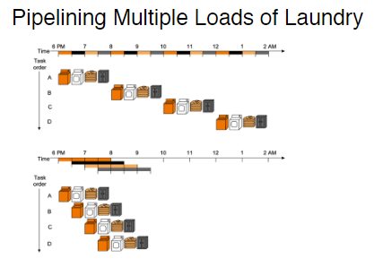

A pipeline is like an assembly line; in an assembly line, there are many steps that each contribute something to the construction of the final product. Each step operates in parallel with other steps, although on a different producct. In a computer pipeline, each step in the pipeline completes a part of an instruction. Like the assembly line, different steps are completing different parts of different instructions in parallel.

Each of these steps is called a *pipe stage* or a *pipe segment*. The stages are connected one to the next to form a pipe - instructions enter at one end, progress through the stages, and exit at the other end.

Some terminology:

- Throughput: Defined as the number of instructions completed per unit of time. It is a measure of how fast the pipeline is able to complete instructions. Since the pipe stages are hooked together, all the stages must be ready to proceed at the same time, just as we would require in an assembly line.
  
  The time required between moving an instruction one step down the pipeline is a *processor cycle.* Since all stages must proceed at the same time to maintain synchronization, the length of a processor cycle is determined by the time required for the slowest pipe stage. In computers, the processor cycle is almost always 1 clock cycle.

The goal of the pipeline designer is to balance the length of each pipeline stage. If the stages are perfectly balanced, then the time per instruction on the pipelined processor is:

$$\frac{\text{Time per instruction on unpipelined machine}}{\text{Number of pipe stages}}$$

From the slides: We have a four-stage pipeline. Every stage takes 1 hour. How long does it take to finish 100 loads?

*We know each load will take 4 hours to complete. However, they're done in parallel so 400 hours is obviously not the answer. Instead:*

- 1st hour: Load 1 - Stage 1
- 2nd hour: Load 1 - Stage 2 | Load 2 - Stage 1
- 3rd hour: Load 1 - Stage 3 | Load 2 - Stage 2 | Load 3 - Stage 1
- 4th hour: Load 1 - Stage 4 | Load 2 - Stage 3 | Load 3 - Stage 2 | Load 4 - Stage 1
- 5th hour: Load 1 - Done | Load 2 - Stage 4 | Load 3 - Stage 3 | Load 4 - Stage 2 | Load 5 - Stage 1

Every hour past the 4th hour, we finish a load. So, 4 + 99 = 103 hours.

Mathematically, the equation for this is:

$$\text{Time} = \text{Number of stages} + (\text{Number of instructions} - 1)$$

### An Ideal Pipeline

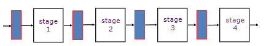

In an ideal pipeline:

- All objects go through the same stages
- No sharing of resources between any two stages
- Propagation delay through all pipeline stages is equal
  
  This means that each stage in the pipeline takes the same amount of time to process its part of a task. This uniformity ensures that no single stage becomes a bottleneck due to taking longer than the others, allowing for a smooth and predictable flow of tasks through the pipeline.

- Scheduling of a transaction entering the pipeline is not affected by the transactions in other stages.
  
  This implies that the arrival of a new task into the pipeline does not depend on the status or progress of tasks currently being processed in other stages. Each stage operates independently in terms of accepting new tasks, which helps in maintaining a consistent rate of processing without delays caused by inter-stage dependencies.

- These conditions generally hold for real world assembly lines, but instructions depend on each other causing various hazards

### The Instruction Execution Cycle

- Instruction Fetch (IF): The processor fetches the instruction from memory.
- Instruction Decode and Register Operand Fetch (ID/RF): The processor decodes the instruction and reads the operands from the register file.
- Execute/Evaluate memory address (EX/AG): The processor performs the operation specified by the instruction.
- Memory operand fetch (MEM): The processor reads or writes the memory operand.
- Write back (WB): The processor writes the result back to the register file.

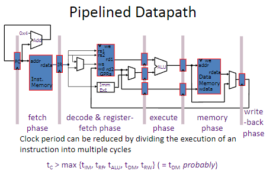

To understand this more clearly, we have to understand how a RISC instruction set can be implemented without pipelining. The following is a simple example of a RISC instruction set:

- Instruction Fetch Cycle (IF):
  
  Send the program counter(PC) to memory and fetch the current instruction from memory. Update PC to the next sequential instruction by adding 4 (because each instruction is 4 bytes or 32 bits) to the PC.

- Instruction Decode and Register Fetch Cycle (ID):
  
  Decode the instruction and read the registers corresponding to register source specifiers from the register file. Do the equality test on the registers as they are read, for a possible branch. Sign-extend the offset field of the instruction in case it's needed. Compute the possible branch target address by adding to the incremented PC.

  Decoding is done in parallel with reading registers, which is possible because the register specifiers are at a fixed location within the RISC architecture.

- Execution Cycle (EX):
  
  The ALU operates on the operands prepared in the prior cycle, performing one of three functions, depending on the instruction type.

  - Memory reference: The ALU adds the base register and the offset to form the effective address.
  - Register-register ALU instruction: The ALU performs the operation specified by the ALU opcode on the values read from the register file.
  - Register-Immediate ALU instruction: The ALU performs the operation specified by the ALU opcode on the first value read from the register file and the sign-extended immediate.
  - Conditional branch: Determine whether the condition is true.
  
  In a load-store architecture, the effective address and execution cycles can be combined into a single cycle since no instruction needs to simulatneously calculate a data address and perform an operation on the data.

- Memory Access Cycle (MEM):
  
  If the instruction is a load, the memory does a read using the effective address computed in the previous cycle. If it's a store, then the memory writes the data from the second register read from the register file using the effective address.

- Write Back Cycle (WB):
  
  Register-Register ALU instruction or Load instruction: Write the result of the ALU operation or the data read from memory into the register file.

In this implementation, branch instructions require three cycles, store instructions require four cycles, and all other instructions require five cycles.

We can pipeline the executing described above with almost no changes simply by starting a new instruction on each clock cycle. Each of the clock cycles above becomes a *pipe stage*. This results in the execution pattern show below:

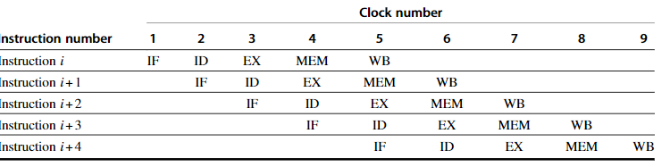

However, this is just a simple example. In reality, there are many hazards that can occur in a pipeline. Pipelining introduces many problems.

To start, we have to determine what happens on every clock cycle of the processor and make sure we don't try to perform two different operations with the same data path resource on the same clock cycle. For example, a single ALU cannot be asked to compute an effective address and perform a subtract operation at the same time. Thus, we must ensure that the overlap of instructions in the pipeline cannot cause such a conflict.

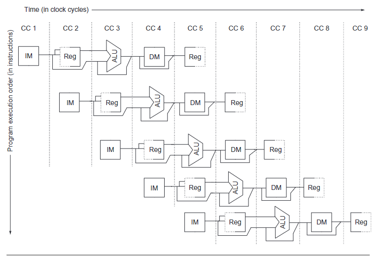

The image above is a more detailed view of the pipeline. We can make several key observations:

- First, we use separate instructions and data memories, which we would typically implement with separate instruction and data caches. The use of separate caches elimiates a conflict for a single memory that would arise between instruction fetch and data memory access.
- Second, the register file is used in two stages: one for reading in ID and one for writing in WB. These uses are distinct, so we simply show the register file in two places. Hence, we need to perform two reads and one write every clock cycle.
- Third, the figure above does not deal with the PC. To start a new instruction every clock, we must increment and store the PC every clock, and this must be done during the IF stage in preparation for the next branch.

Although it's critical to ensure that instructions in the pipeline do not attempt to use the hardware resources at the same time, we must also ensure that instructions in different stages of the pipeline do not interfere with one another. This separation is done by introducing *pipeline registers* between successive stages of the pipeline; this ensures that at the end of a clock cycle all the results from a given stage are store in the register that is used as the input to the next stage on the next clock cycle.

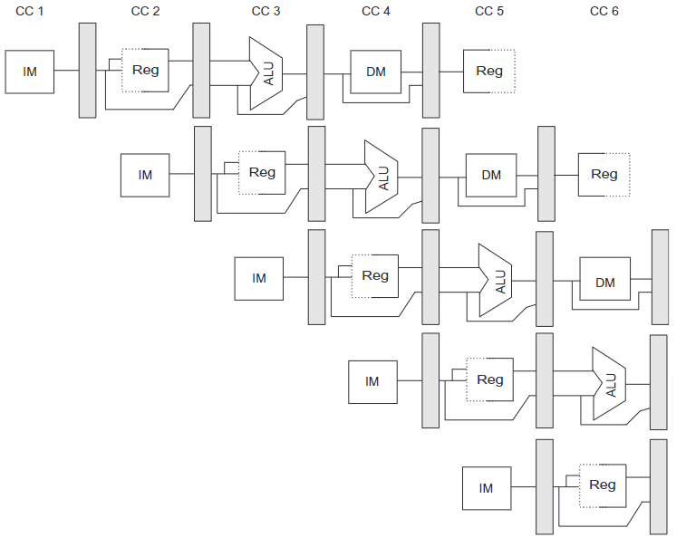

**Think of a factory assembly line where toys are being made. Each part of the line does a different job, like painting, adding wheels, or putting on stickers. Now, imagine there are little storage boxes between each part of the line. After one part finishes its job, it puts the toy into one of these boxes so the next part can pick it up and do its job. This way, each part of the line can work on a different toy at the same time, making the whole process faster.**

**In a computer, the assembly line is like the instruction execution process, and the little storage boxes are like pipeline registers. Pipeline registers hold the information that one stage of the process has finished working on, so the next stage can pick it up and do its part. This helps the computer to work on many instructions at once, making it much faster at processing information.**

Pipeline registers are called (IF/ID), (ID/RF), (EX/AG), (MEM), and (WB) in the figure above. The pipeline registers are used to store the results of the current stage so that the next stage can use them. This is how we can ensure that instructions in different stages of the pipeline do not interfere with one another.

### Basic Performance Issues in Pipelining

Pipelining increases processor instruction throughput, but does not reduce the execution time of an individual instruction. It actually slightly increases the execution time since we've introduced additional overhead in the control of the pipeline. The increase in instruction throughput means that a program runs faster and has a lower total execution time, even though the execution time of an individual instruction is slightly longer.

The fact that the execution time of each instruction does not decrease puts limits on the practical depth of a pipeline. In addition to limitations arising from pipline latency, limits arise from imbalance among the pipe stages and from pipelining overhead. Imbalance among the pipestages reduces the performance since the clock can't run faster than the time needed for the slowest stage. Overhead arises from the combination of pipeline register delay and clock skew.

Pipeline registers add setup time, which is the time that a register input must be stable before the clock signal that triggers a write occurs, plus propagation delay to the clock cycle. Clock skew, which is the maximum delay between when the clock arrives at any two registers also contributes to the lower limit on the clock cycle time.

### The Major Hurdle of Pipelining: Hazards

There are situations, called *hazards*, that prevent the next instruction in the instruction stream from executing during its designated clock cycle. There are three classes of hazards:

- Structural hazards: These arise from resource conflicts when the hardware cannot support all possible combinations of instructions simulataneously in overlapped execution.
  
  I.e., the same stage is needed by two different instructions at the same time. For example, if the ALU is needed by two different instructions at the same time, the pipeline will stall.

  In modern processors, structural hazards occur primarily in special purpose functional units that are less ffrequently used (such as floating point divide or other complex long running instructions). These are not as frequent as the other two types of hazards.

- Data hazards: These arise when an instruction depend on the result of a previous instruction in a way that's exposed by the overlapping of instructions in the pipeline.
  
  For example, if the result of an instruction is needed by the next instruction, the pipeline will stall.

- Control hazards: These arise from the pipelining of branches and other instructions that change the PC.

  For example, if the pipeline fetches the wrong instruction, the pipeline will stall.

Hazards in pipelines can make it necessary to *stall* the pipeline. Avoiding hazards often require that some instruction in the pipeline be allowed to proceed while others are delayed. For pipelines discussed in this book, when instructions are stalled, all instructions issued later than the stalled instruction are also stalled. Instructions issued before the stall must continue otherwise the hazard never clears. As a result, no new instructions are fetched during the stall.

### Performance of Pipelines with Stalls

Stalls cause the performance of a pipeline to degrade from the ideal performance. We can use a simple equation for finding the actual speedup from pipelineing:

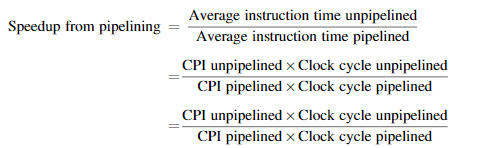

Pipelining can be thought of as decreasing the CPI or the clock cycle time. It's traditional to use the CPI to compare pipelines, so we can start with that assumption. The ideal CPI on a pipelined processor is almost always 1. Therefore:

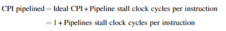

If we ignore the cycle time overhead of pipelining and assume that the stages are perfectly balanced, then the cycle time of the two processors can be equal. This leads to:

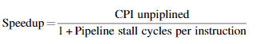

One important simple case is where all instructions take the same number of cycles, whicch must also be equal to the number of pipeline stages (aka the pipeline depth). In this case, the unpipelined CPI is equal to the depth of the pipeline:

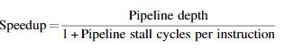

### Data Hazards

More in-depth, data hazards occur when the pipeline changes the order of read/write accesses to operands so that the order differs from the order seen by sequentially executing instructions on an unpipelined processor. Simply put, a data hazard occurs when an instruction depends on the result of a previous instruction in a way that's exposed by the overlapping of instructions in the pipeline.

Assume instruction $i$ occurs in program order before instruction $j$ and both instructions use register$x$, then there are three different types of data hazards that occur between $i$ and $j$:

- Read after write (RAW): The most common. These occur when a read of register $x$ by instruction $j$ occurs before the write of register $x$ by instruction $i$. If this hazard is not prevented, instruction $j$ will use the wrong value of register $x$.
- Write after read (WAR): These occur when read of register $x$ by instruction $i$ occurs after a write of register $x$ by instruction $j$. In this case, instruction $i$ would use the wrong value of $x$. WAR hazards are impossible in the simple five stage pipeline we described, but they occur when instructions are reordered as we will see in dynamically scheduled pipelines.
- Write after write (WAW): These hazards occur when write of register $x$ by instruction $i$ occurs after a writer of register $x$ by instruction $j$. When this occurs, register $x$ has the wrong value going forwards. These are also impossible in the simple five stage pipeline we described, but they occur when instructions are reordered or when running times vary.

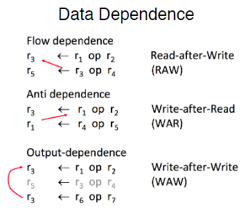

### Minimizing Data Hazards by Forwarding

**Forwarding** is a simple hardware technique (also called **bypassing** or **short-circuiting**) that can solve some data hazards without stalling. The key insight in forwarding is that the result is not really needed by the next instruction until after the result is written into the register file.

We'll use an example to illustrate this:

```assembly
add x1, x2, x3
sub x4, x1, x5
```

The key insight into forwarding is that the result is not really needed by sub until after the add actually produces it. If the result can be moved from the pipeline register where the add stores it to where the sub needs it, then the need for the stall can be avoided. Forwarding works as follows:

- The ALU result from both the EX/MEM and MEM/WB pipeline registers is awlays fed back to the ALU inputs. This is because the ALU result is always needed by the next instruction.
- If the forwarding hardware detects that the previous ALU operation has written the register corresponding to a source for the current ALU operation, control logic selects the forwarded result as the ALU input rather than the value read from the register file.

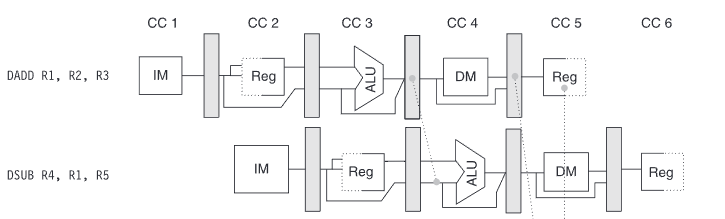

From the figure above, the pipeline register between the ALU and dm "loops" back to itself or forwards itself for the next instruction. This is the forwarding path. The forwarding path is used to bypass the register file and provide the result of the previous ALU operation directly to the next ALU operation.

### Data Hazards Requiring Stalls

Forwarding can solve some data hazards without stalling, but not all. Consider the following example:

```assembly
ld x1, 0(x2)
sub x4, x1, x5
and x6, x1, x7
or x8, x1, x9
```

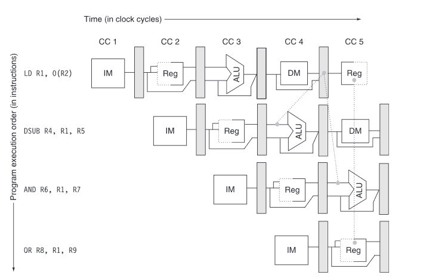

This case is different. The ld instruction does not have the data until the end of clock cycle 4 (the mem cycle). While the sub instruction needs to have the data by the beginning of that clock cycle. Thus, the data hazard from using the result of a load instruction cannot be completely elimiated with simple hardware. A forwarding path would have to operate backwards in time.

### Branch Hazards

*Control Hazards* can cause greater performance loss for our pipeline than data hazards. When braches execute, it may or may not change the PC to something other than its current value plus 4. Recall, if a branch changes the PC to its target address, it's the *taken branch*. If it doesn't, it's the *not taken branch*.

If instruction *i* is the taken branch, then the PC is usually not changed until the end of ID, after the completion of address calculation and comparison.

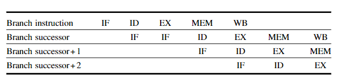

The figure above shows the simplest method of dealing with branches is to redo the fetch of the instruction following a branch, once we detect the branch during ID (when instructions are decoded). The first IF cycle is essentially a stall, since it never performs useful work. You may have noticed that if a branch is untaken, then the repetition of the IF stage is unnecessary since the correct instruction was indeed fetched. Several schemes take advantage of this fact.

One stall cycle for every branch yields about a 10 to 30 percent performance loss depending on the brnach frequency.

*Recall control hazards occur when we may need to calculate the next PC:*

- For jumps; Opcode; offset, and PC
- For jump register; Opcode and register value
- For conditional branches; Opcode, PC, register (for condition), and offset
- For all other instructions; Opcode and PC

Opcode decoding bubbles may occur when there is a delay or 'bubble' in the piple due to the time it takes to decode the opcode of an instruction. This delay can lead to inefficiencies in the pipeline since subsequent instructions must wait until the decoding is complete before they can execute.

This concept is illustrated with an example where instructions are fetched and decoded at different stages, leading to a situation where not every stage of the pipeline is utilized efficiently at all times.

Metaphorically, the bubble represents the gap or idle time in the pipleline caused by delays. NOP (no operation) instructions are used to fill these gaps.

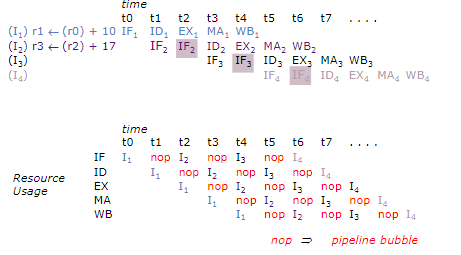

**Imagine you have a toy train set where the train has to go through several stations to complete its journey. Each station is a step in the journey, like picking up passengers (fetching an instruction), deciding where to go next (decoding the instruction), actually going there (executing the instruction), and dropping off passengers (writing back the results). Now, imagine if the train could only move when all the stations are ready for it. If one station is slow or not ready, the train has to wait, which makes the journey longer. In a computer, we want the 'train' (data) to move as smoothly and quickly as possible from one 'station' (part of the processor) to another without unnecessary waiting. This is what we try to achieve in computer architecture by making sure each part of the process is efficient, so our 'train' can complete its journey quickly and start a new one right away!**

### Reducing Pipeline Branch Penalties

Software can be used to minimize the branch penalty using knowledge of the hardware scheme and of branch behavior. Hardward-based schemes that dyanmically predict branch behavior could also be used.

- The simplest scheme to handle branches is to *freeze* or *flush* the pipeline, holding or deleting any instructions after the branch until the branch destination is known. It's very simple to implement.
- A higher performance and more complex scheme is to treat every branch as not taken, simply allowing the hardware to continue as if the branch were not executed. Here, care must be taken not to change the processor state until the branch outcome is definitely known.
  
  The complexity of this scheme arises from having to know where the state might be changed by an instruction and how to back out such a change.

  In this scheme, it continues to fetch instructions as if the branch were a normal instruction. The pipeline looks as if nothing out of the ordinary is happening. If the branch is taken, however, we need to turn the fetched instruction into a no-op and then start fetching from the branch target address. The figure below shows both situations:

  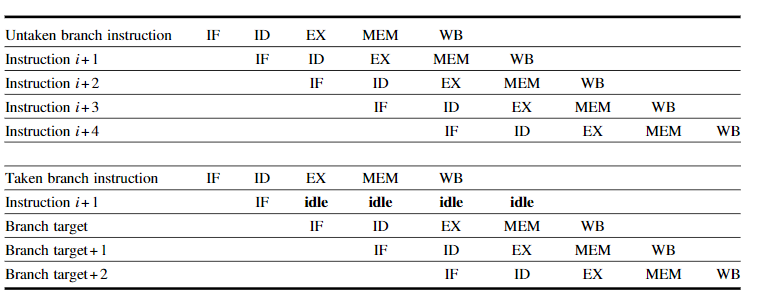

- Alternatively, we could treat every branch as taken. As soon as the brnach is decoded and the target address is computed, we assume it's taken and begin fetching/executing at the target. This buys us a one-cycle improvement when the branch is actually taken, because we know the target address at the end of ID, one cycle before we know whether the branch condition is satisfied in the ALU stage.

- A fourth scheme, which was used in early processors is called *delayed branch.* In delayed branch, the execution cycle with a branch delay of one is:
  
  ```assembly
  branch instruction
  seuqential successor 1
  branch target if taken
  ```

  The sequential successor is in the *branch delay slot.* This instruction is executed whether or not the branch is taken. The figure below shows the execution of a delayed branch:

  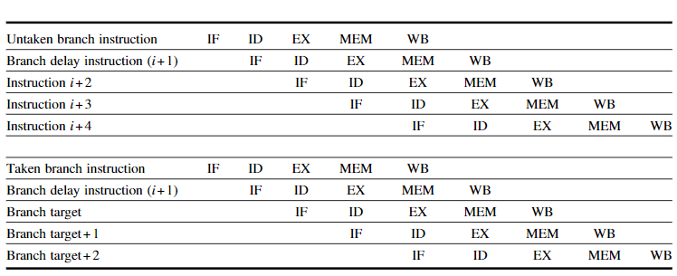

 **I.e., when a computer executes instructions, it often encounters branches - points where it needs to make a decision on which set of instructions to follow next. This could be likened to choosing between two paths in a game. The decision on which path to take might depend on certain conditions, like whether a player has collected enough points or not. In a computer, this decision-making process takes time, and during this time, the pipeline that processes instructions could be idle, which is not efficient.**

 **To make better use of this idle time, computers use something called a branch delay slot. This is essentially a space right after a branch instruction where another instruction is placed and executed regardless of the branch outcome. This means that while the computer is deciding which path to take, it's also doing something useful by executing another instruction, rather than waiting around doing nothing. This helps keep the pipeline busy and improves the overall efficiency of the instruction processing.**

 **The key to effectively using branch delay slots is to place an instruction in that slot which is beneficial to execute regardless of the branch's direction. This could be an instruction that doesn't affect the outcome of the branch decision but contributes to the overall task the computer is performing. By doing so, the computer ensures that no time is wasted, and the instruction pipeline is utilized as efficiently as possible.**

Although the delayed branch was useful for short simpel pipelines at a time when hardware prediction was expensive, the technique complicates implementation when there is dynamic branch prediction.

## 3.1 ILP: Concepts and Challenges

All modern processors use pipelining to overlap the execution of instructions. This potential overlap among instructions is called *instruction-level parallelism (ILP)*. This section of the book looks atthe limitations imposed by data and control hazards and turns to the topic of increasing the ability of the compiler and the processor to exploit parallelism.

There are two largely separable approaches to exploit ILP:

- An approach that relies on hardware to help discover and exploit parallelism dynamically
- An approach that relies on software tech to find parallelism statically at compile time.
Processors using the dynamic hardware-based approach dominate in the desktop and server markets. We also discuss features of both programs and processors that limit the amount of parallelism that can be exploited among instructions, as well as critical mapping between program structure and hardware structure. This is key to understanding whether a program property will actually limit performance and under what circumstances.

CPI for a pipelined processor is the sum of the base CPI and all contributions from stalls:

$$\text{Pipeline CPI} = \text{ideal pipeline CPI (usually 1) + Structural Stalls + Data Hazard Stalls + Control Stalls}$$

### Data Dependecies

Three types of dependencies can limit the amount of parallelism that can be exploited among instructions:

- Data dependecies
  
  An instruction *j* is data-dependent on *i* if either of the following hold true:
  
  - *i* produces a result that *j* uses
  - Instruction *j* is data-dependent on instruction *k* and instruction *k* is data-dependent on instruction *i*
  
  The second condition simply states that one instruction is dependent on another if there exists a chain of depndences of the first type between the two instructions. This is called a *transitive dependence*.

- Name Dependecies
  
  These occur when two instructions use the same register or memory location, called a name, but there is no flow of data between the two instructions associated wit hthe name. There are two types of name dependences between an instruction *i* that precedes instruction *j*:

  - Antidependence between *i* and *j* occurs when *j* writes a register or memory location that instruction *i* reads. The original ordering must be preserved to ensure that *i* reads the correct value. Recall, memory reading occurs in the memory stage of the pipeline, and is later than the write stage.
  - Output dependence occurs when *i* and *j* writes to the same register or memory location. The ordering between the instructions must be preserved to ensure that the correct value is written.

- Control Dependence
  
  The control dependence determines the ordering of an instruction *i* with respect to a branch instruction so that *i* is executed in the correct program order and only when it should be.

## Lecture

### Superscalar Pipelines

Processors studied so far are fundamentally limited to $CPI \geq 1$. SS Processors enable $CPI < 1$ by executing multiple instructions in parallel, instructions per cycle (IPC) > 1.

We can have both in-order and out-of-order SS processors.

#### In-order SS Processors

Superscalar processors are designed to improve the performance of computing systems by executing multiple instructions in parallel within a single clock cycle. This capability is fundamentally different from scalar processors, which are limited to executing one instruction per clock cycle, resulting in a Clocks Per Instruction (CPI) value of 1 or greater. In contrast, superscalar processors can achieve a CPI of less than 1, meaning they can execute more than one instruction per cycle (IPC > 1).

The key to superscalar architecture is its ability to dispatch, execute, and complete multiple instructions simultaneously. This is achieved through various mechanisms, including multiple execution units, out-of-order execution, and advanced branch prediction. Superscalar processors can be designed to execute instructions either in-order or out-of-order. In-order superscalar processors execute instructions in the sequence they appear in the program, while out-of-order processors can execute instructions as their operands become available, potentially out of their original sequence, to optimize utilization of execution units and reduce stalls.

The introduction of superscalar processors represents a significant advancement in processor design, enabling higher throughput and improved performance for a wide range of computing tasks.
