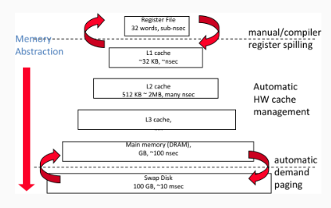
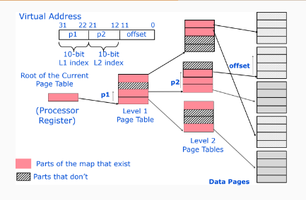
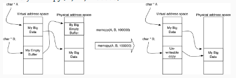

<!-- pandoc example.md -o example.pdf -->

## Lecture 7: Virtual Memory

"A system has been devised to make the core drum combination appear to the programmer as a single level store, the requisite transfers taking place automatically."

Recall, capacity misses occur because the processor is trying to access too much data. If the working set is bigger than the cache, then the cache will miss frequently.

We could try to:

- Increase the capacity of the cache
- Increase associativity or more associative sets; however it makes the cache slower

### Virtual Memory


To a programmer, memory should be a blackbox. Ideally, memory should also be zero-latency, infinite bandwidth, infinite capacity, and linear memory space.

*Recall, bandwidth, in the context of memory, refers to the maximum rate at which data can be read/written from to the memory from the processor.*

*We desire infinite bandwidth when it comes to memory because it would mean that data could be transferred between the memory and the processor instantaneously, without any delay. This would ideally eliminate any bottlenecks in data transfer, allowing the processor to operate at its maximum potential without being slowed down by memory access times.*

*In reality, achieving infinite bandwidth is not possible due to physical and technological limitations, but the goal is to increase the bandwidth as much as possible to improve system performance.*

Here's a figure of the modern memory hierarchy to refresh our memory:



At any instant in time computers are running multiple processes. Each of these processes have their own address space. It'd be too expensive to dedicate a full address space worth of memory for each process, especially since many processes use only a small part of their address space at any point. Hence, there must be a way of sharing a smaller amount of physical memory amongst multiple processes. This is done using virtual memory.

Virtual memory is a fundamental concept in computing systems, providing several important benefits and capabilities. There are several reasons why virtual memory is needed:

- Abstraction and isolation
- Memory overcommitment
- Efficient use of physical memory
- Program bigger than physical memory
- Simplified memory management for programs
- Flexibility

Virtual memory divides physical memory into blocks, and allocates them to different processes. Inherent in such an approach must be a *protection scheme* that restricts a  process to the blocks belonging only to that process. Most forms of vm also reduce the time to start a program since not all of the code/data need to be in physical memory before a program can begin.

Although protection provided by vm is essential for modern computers, sharing is not the reason vm was invented. If a program becomes too large for physical memory, it was the programmer's job to make it fit. They'd do this by dividing programs into pieces, then identified the pieces that were mutually exclusive, and loaded or unloaded these overlays under under program control during execution. The programmer ensured that the program never tried to access more physical main memory than was available, plus the correct overlay was loaded at the proper time. This was a very difficult and error-prone process.

VM automatically manages two levels of the memory hierarchy represented by main memory and secondary storage. The figure below shows the mapping of vm to physical memory for a program with four pages.


In addition to sharing protected memory space and automatically managing memory hierarchy, vm also simplifies loading the program for executing. Called *relocation*, this mechanism allows the same program to run in any location within physical memory. From the figure above, the program can be placed anywhere in physical memory/disk just by changing the mapping between themm.

Several general mh ideas about caches are analogous to vm, although many of the terms are different:

- *Pages* or *segments* is analogous to *blocks* in a cache.
- *Page fault* or *address fault* is analogous to *cache miss*.

With vm, the processor produces *virtual addresses* that are translated by a combination of hardware and software to *physical addresses* which access main memory. This process is called *memory mapping* or *address translation*.

VM also encompasses several related techniques. VM systems can be categorized into two classes; those with fixed-size blocks (pages), and those with variable-size blocks (segments). Pages are typically fixed at 4096-8192 bytes, while segments are variable in size.


The decision to use paged vm vs. segmented vm affects the processor. Paged addressing has a single fixed-size address divided into page number and offset within a page, analogous to cache addressing. A single address does not work for segmented addresses; the variable size of segments requires 1 word for a segment number and 1 word for an offset within a segment, for a total of 2 words. Unsegmented address spaces are simpler to implement.

The pros and cons of paged vs. segmented vm are:


**To summarize, both the physical and virtual address spaces are broken up into pages; typically 4 KiB in size, sometimes larger. A page table is used to map between the virtual and physical pages. The processor generates virtual addresses which are translated via address translation into physical addresses.**


### Four MH Questions Revisited

#### Where can a block be placed in main memory?
  
  The miss penalty for VM involves access to a rotating magnetic storage device and is therefore quite high. Given the choice of lower miss rates or a simpler placement algorithm, OS designers usually pick lower miss rates because of the exorbitant miss penalty. Thus OS allows blocks to be placed anywhere in main memory. This is called *fully associative placement*.

#### How is a block found if it is in main memory?
  
  Both paging and segmentation rely on a data structure that is indexed by the page or segment number. This data structure contains the physical address of the block. For segmentation, the offset is added to the segment's physical address to obtain the final physical address. For paging, the offset is simply concatenated to this physical page address.


The data structure, containing the physical page addresses, usually takes the form of a **page table**. Indexed by the virtual page number, the size of the table is the number of pages in the virtual address space. Given a 32-bit virtual address, 4 KiB pages, and 4 bytes per page table entry (PTE), the size of the page table would be $\frac{2^32}{2^12} \times 2^2 = 2^22$ or 4 MiB.

To reduce the size of this data structure, some computers apply a hashing function to the VA. The hash allows the data structure to be the length of the number of physical pages in main memory. This number could be much smaller than the number of virtual pages. These structures are called *inverted page tables.*

#### Which block should be replaced on a VM miss?

The overriding OS guideline is to minimize page faults. Almost all OS try to replace the LRU block because if the past predicts the future, that's one less likely to be needed. To help the OS estimate LRU, many processors provide a *use bit* or *reference bit*, which is logically set whenever a page is accessed. The OS periodically clears the use bits and later records them so it determines which pages were touched during a particular time period.

#### What happens on a Write?

The level below main memory contains rotating magnetic disks that take millions of clock cycles to access. Because of the great discrepancy in access time, no one has yet built a VM OS that writes through main memory to disk on every store by the processor. Thus, the write strategy is always a write-back.

Recall, write-back writes to the cache and only writes to main memory when the block is replaced. The write-back strategy is used because it reduces the number of writes to main memory, which is important because of the high latency of disk access.

### Storing the Map Compactly

For a 32-bit address space, that's:

$$2^32 bits * \frac{1 KB}{1000 bits} * \frac{1 MB}{1 KB} * \frac{1 GB}{1000 MB} = 4 GiB \text{of virtual addresses}$$

Given 1 million pages, with each entry being 4 bytes (32-bit addresses), that's about 4 MiB of map. For a 64-bit address space, it's even bigger!

We could try to just store the entries that matter, (enough for our physical address space), but it's still pretty big. Even a L3 cache couldn't contain the entire page table. What we need is sparse representation.

- The OS allocates stuff all over the place.
- For security, convenience, or caching optimizations
- Example: Stack is at the top of memory, while the heap is at the bottom.

How would we represent the sparse map?

**I.e., imagine you have a huge library with thousands of books, but you're only interested in books about dinosaurs. Instead of keeping a detailed map of where every single book is, you decide to only keep track of where the dinosaur books are. This way, you don't waste time or space on information you don't need.**

### Storing the Map Compactly: Hierarchical Page Tables

We could use a tree to hold the page table. We do this by breaking the virtual page number into several pieces. If each piece is *N* bits, we'd build a $2^N \text{-ary tree}$.

We only store the parts of the tree that contain valid pages. To do an address translation, we'd walk down the tree using pieces of the address to select which child to visit.



### Trying to perform address translation quickly

Address translation has to happen for each memory access. This puts it squarely on the *critical path* for memory operations, which is already pretty slow. We could try to walk the page table on every memory access, but then every load/store operation requires an additional 3-4 loads to walk the page table. This is because the page table is being stored as a tree, and we have to walk the tree to find the physical address. This is very slow.

If we want to access a lot of data (the page table) very quickly (in a single clock cycle), **we must add a cache.** This special cache holds page mappings and is called the **translation lookaside buffer (TLB).**


TLBs are much smaller (about 16-512 entries), highly associative (often fully associative) caches for page tables. Recall, fully associative means that a block can be placed anywhere in the cache.

Since its a cache, TLB misses are possible which can be expensive. To make them less expensive, there are *hardware page table walkers* which are specialized state machines that can load page table entries into the TLB without OS intervention.

With this, the page table format is now a part of the architecture. Typically, the OS can disable the walker and implement its own format.

### When to translate

There's a critical question that we need to ask ourselves: Do we translate before or after cache access? If we translate before we got to the cache, we have a *physical cache.* That is, a cache that works on physical addresses.


Alternatively, we could translate after the cache. Now translation is only required on miss. This would be a *virtual cache* since it caches according to virtual addresses.


### Dangers of Virtual Cache

Consider the following situation: Process A is running an issues a memory request to address $0x10000$. It's a miss and $0x10000$ is brought into the virtual cache.

A **context switch** occurs.

Process B starts running and issues a request for address $0x10000$. It's a hit! But will it get the right data? **No, we must flush virtual caches on context switches.**

Additionally, there's no rule that says each virtual address maps to different physical address. When this occurs, it's called **aliasing.**


If we store $B$ to $0x1000$, then the load from $0x2000$ returns the wrong value. Alising is useful for implementing **copy-on-write** memory.

Consider a situation where you have to copy a large chunk of memory:

```c
memcpy(A, B, 100000);
```



Two virtual addrresses would then point to the same physical address. Adjusting the page table is much faster for large copies. The initial copy is free, and the OS will catch attempts to write to the copy and perform the actual copy lazily.